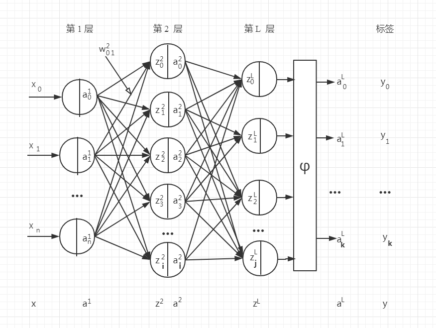

# Theoretical-Proof-of-Neural-Network-Model-and-Implementation-Based-on-Numpy
> Talk is easy ,show me the proof and code.
 
This resource implements a deep neural network through Numpy, and is equipped with easy-to-understand theoretical derivation, mainly for the in-depth understanding of neural networks.
神经网络模型的理论证明与基于Numpy的实现。

## Installation
This repo was tested on Python 3.6

```
pip install numpy
```

## Feedforward neural network 前馈神经网络模型图


## Recurrent neural network 循环神经网络模型图


