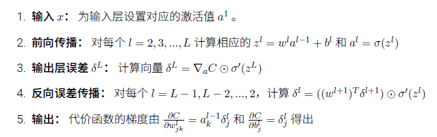
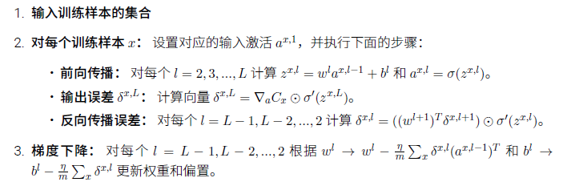
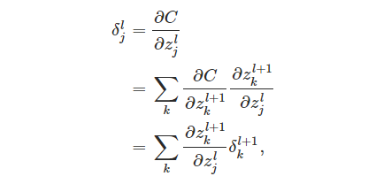
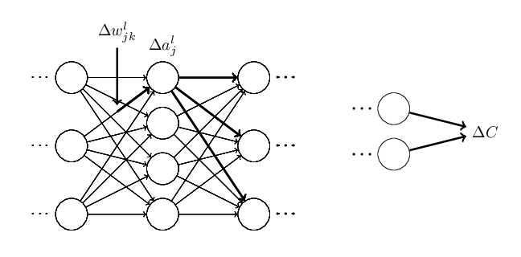
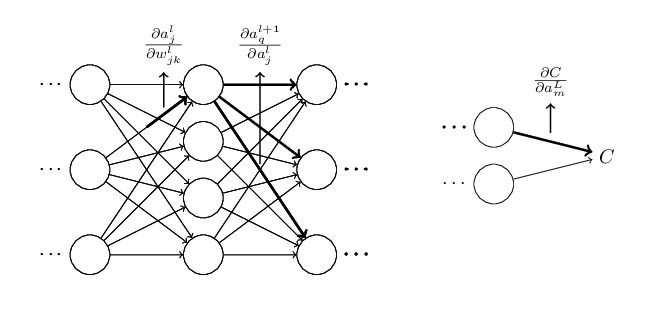

# 反向传播算法

> 原文链接：[CHAPTER 2 How the backpropagation algorithm works](http://neuralnetworksanddeeplearning.com/chap2.html)

## 反向传播概述

反向传播算法最初在 1970 年代被提及，但是人们直到 David Rumelhart、Geoffrey Hinton 和 Ronald Williams 的著名的 1986 年的论文中才认识到这个算法的重要性。

反向传播的核心是一个对代价函数 $C$ 关于任何权重 $w$ 和 偏置 $b$ 的偏导数 $\partial{C}/\partial{w}$ 的表达式。

这个表达式告诉我们在改变权重和偏置时，代价函数变化的快慢。

## 关于代价函数的两个假设

1. 代价函数可以被写成在每一个训练样本 $x$ 上的代价函数 $C_x$ 的均值 $C=\frac{1}{n}\sum_{x}C_x$。

2. 代价函数可以写成神经网络输出的函数。

需要假设1的原因是，反向传播实际上是对一个独立的训练样本计算了 $\partial{C_x}/\partial{w}$ 和 $\partial{C_x}/\partial{b}$。然后通过在所有训练样本上进行平均化获得 $\partial{C}/\partial{w}$ 和 $\partial{C}/\partial{w}$ 。

需要假设2的原因是，要把代价函数与神经网络输出联系起来，进而与神经网络的参数联系起来。

## 符号定义


> $W_{jk}^{l}$ 是从 $l-1$ 层的第 $k$ 个神经元到 $l$ 层的第 $j$ 个神经元的权重。

> $b_j^l$ 是第 $l$ 层的第 $j$ 个神经元的偏置。

> $a_j^l$ 是第 $l$ 层的第 $j$ 个神经元的激活值。

> $\sigma$ 是激活函数。

把上面的符号向量化
> $W^{l}$ 是权重矩阵，第 $j$ 行 $k$ 列的元素是 $W_{jk}^{l}$。

例如第二层与第三层之间的权重矩阵是

$$
    w^3 = { \left[
     \begin{matrix}
       w_{11}^3 & w_{12}^3 & w_{13}^3 & w_{14}^3\\
       w_{21}^3 & w_{22}^3 & w_{23}^3 & w_{24}^3
      \end{matrix}
      \right] }$$

> $b^l$ 是偏置向量。第 $j$ 行的元素是 $b_j^l$。

例如第二层的偏置向量是

$$
    b^2 = { \left[
     \begin{matrix}
       b_{1}^2  \\
       \\
       b_{2}^2\\
       \\
       b_{3}^2\\
       \\
       b_{4}^2
      \end{matrix}
      \right] }
$$


有了这些表示 $l$ 层的第 $j$ 个神经元的激活值 $a_j^l$ 就和 $l-1$ 层的激活值通过方程关联起来了

$$a^{l}_j = \sigma\left( \sum_k w^{l}_{jk} a^{l-1}_k + b^l_j \right)$$

把上面式子向量化

$$ a^{l} = \sigma(w^l a^{l-1}+b^l)$$

例如第三层的激活向量是

$$
 { \left[
 \begin{matrix}
   a_{1}^3  \\
   \\
   a_{2}^3 \\
  \end{matrix}
  \right] }
  =\sigma\left(
  { \left[
   \begin{matrix}
     w_{11}^3 & w_{12}^3 & w_{13}^3 & w_{14}^3\\
     w_{21}^3 & w_{22}^3 & w_{23}^3 & w_{24}^3
    \end{matrix}
    \right] }
    { \left[
    \begin{matrix}
      a_{1}^2  \\
      \\
      a_{2}^2 \\
      \\
      a_{3}^2  \\
      \\
      a_{4}^2 \\
     \end{matrix}
     \right] }+
     { \left[
      \begin{matrix}
        b_{1}^3  \\
        \\
        b_{2}^3 \\
       \end{matrix}
       \right] }\right)
$$

> $a^{l}$ 是激活向量。第 $j$ 行的元素是 $a_j^l$。

定义
$$z^l \equiv w^l a^{l-1}+b^l$$

则 $a^l =\sigma(z^l)$

> $z^l$ 表示第第 $l$ 层的带权输入。第 $j$ 个元素是 $z_j^l$。

$$ z^l_j=\sum_k w^l_{jk} a^{l-1}_k+b^l_j $$

> $z_j^l$ 是第 $l$ 层的第 $j$ 个神经元的带权输入。

反向传播的核心是一个对代价函数 $C$ 关于任何权重 $w$ 和 偏置 $b$ 的偏导数 $\partial{C}/\partial{w}$ 的表达式。为了计算这些值，引入一个中间量 $\delta_j^l$ ,表示在 $l$ 层的第 $j$ 个神经元的误差。

定义
$$\delta^l_j \equiv \frac{\partial C}{\partial z^l_j}.$$

$\delta^l$ 是误差向量，$\delta^l$ 的第 $j$ 个元素是 $\delta_j^l$。


## 反向传播的四个基本方程


$\nabla_a$ 是求梯度运算符，$\nabla_a C$ 结果是一个向量，其元素是偏导数 $\partial C / \partial a^L_j$。

$\odot$ 是按元素乘积的运算符，$ {(s \odot t)}_j = s_j t_j $ ，例如

$$
\left[\begin{array}{c} 1 \\ 2 \end{array}\right]
  \odot \left[\begin{array}{c} 3 \\ 4\end{array} \right]
= \left[ \begin{array}{c} 1 * 3 \\ 2 * 4 \end{array} \right]
= \left[ \begin{array}{c} 3 \\ 8 \end{array} \right].
$$

|计算公式|维度变化|
|-|-|
|$\delta^L =\nabla_a C\odot \dfrac{\partial f^{(L)}}{\partial z^L} $|$(d^L, 1) = (d^L, 1) * (d^L, 1)$|
|$\delta^{(l)} =({(w^{(l+1)})}^T\delta^{(l+1)})\odot \sigma'(z^l) $|$(d^l, 1) = {({d}^{l+1}, {d}^{l})}^T (d^{l+1}, 1) * (d^l, 1)$|
|$\dfrac{\partial C}{\partial b^{(l)}} =\delta^{(l)}$|$(d^l, 1) = (d^l, 1)$|
|$\dfrac{\partial C}{\partial w^l} = \delta^l (a^{l-1})^T $|$(d^l, d^{l-1}) = (d^l,1) {(d^{l-1}, 1)}^T$|

## 反向传播算法



正如我们上面所讲的，反向传播算法对一个训练样本计算代价函数的梯度，$C=C_x$。在实践中，通常将反向传播算法和诸如随机梯度下降这样的学习算法进行组合使用，我们会对许多训练样本计算对应的梯度。特别地，给定一个大小为 m 的小批量数据，下面的算法在这个小批量数据的基础上应用梯度下降学习算法：



反向传播算法与小批量随机梯度下降算法结合的一个示意代码，完整代码参看 [network.py](https://github.com/MichalDanielDobrzanski/DeepLearningPython35/blob/master/network.py)

```python
def backprop(self, x, y):
        """Return a tuple ``(nabla_b, nabla_w)`` representing the
        gradient for the cost function C_x.  ``nabla_b`` and
        ``nabla_w`` are layer-by-layer lists of numpy arrays, similar
        to ``self.biases`` and ``self.weights``."""
        nabla_b = [np.zeros(b.shape) for b in self.biases]
        nabla_w = [np.zeros(w.shape) for w in self.weights]
        # feedforward
        activation = x
        activations = [x] # list to store all the activations, layer by layer
        zs = [] # list to store all the z vectors, layer by layer
        for b, w in zip(self.biases, self.weights):
            z = np.dot(w, activation)+b
            zs.append(z)
            activation = sigmoid(z)
            activations.append(activation)
        # backward pass
        delta = self.cost_derivative(activations[-1], y) * \
            sigmoid_prime(zs[-1])
        nabla_b[-1] = delta
        nabla_w[-1] = np.dot(delta, activations[-2].transpose())
        # Note that the variable l in the loop below is used a little
        # differently to the notation in Chapter 2 of the book.  Here,
        # l = 1 means the last layer of neurons, l = 2 is the
        # second-last layer, and so on.  It's a renumbering of the
        # scheme in the book, used here to take advantage of the fact
        # that Python can use negative indices in lists.
        for l in range(2, self.num_layers):
            z = zs[-l]
            sp = sigmoid_prime(z)
            delta = np.dot(self.weights[-l+1].transpose(), delta) * sp
            nabla_b[-l] = delta
            nabla_w[-l] = np.dot(delta, activations[-l-1].transpose())
        return (nabla_b, nabla_w)

```

```Python
def cost_derivative(self, output_activations, y):
        """Return the vector of partial derivatives \partial C_x /
        \partial a for the output activations."""
        return (output_activations-y)

def sigmoid_prime(z):
    """Derivative of the sigmoid function."""
    return sigmoid(z)*(1-sigmoid(z))
```

## 四个基本方程的证明


我们现在证明这四个基本的方程（BP）-（BP4）。所有的这些都是多元微积分的链式法则的推论。

### 证明$\delta^L = \nabla_a C \odot \sigma'(z^L)$

从方程（BP1）开始，它给出了误差 $\delta^l$ 的表达式。根据定义

$$\delta^l_j \equiv \frac{\partial C}{\partial z^l_j}.$$

根据关于代价函数的两个假设2 “代价函数可以写成神经网络输出的函数”，应用链式法测可知可先对神经网络输出求偏导${\partial C}/{\partial a^L_k}$再对带权输出求偏导${\partial a^L_k}/{\partial z^L_j}$。

$$
  \delta^L_j = \sum_k \frac{\partial C}{\partial a^L_k} \frac{\partial a^L_k}{\partial z^L_j},
$$

看起来上面式子很复杂，但是由于第 $k$ 个神经元的输出激活值 $a_k^l$ 只依赖于 当下标 $k=j$ 时第 $j$ 个神经元的输入权重 $z_j^l$。所有当 $k\neq {j}$ 时 $\partial a^L_k / \partial z^L_j$ 消失了。结果我们可以简化上一个式子为

$$
  \delta^L_j = \frac{\partial C}{\partial a^L_j} \frac{\partial a^L_j}{\partial z^L_j}.
$$

又因为 $a^L_j = \sigma(z^L_j)$ 所以 $\frac{\partial a^L_j}{\partial z^L_j}$ 可以写成 $\sigma'(z^L_j)$，方程变为

$$
\delta^L_j = \frac{\partial C}{\partial a^L_j} \sigma'(z^L_j)
$$

这就是分量形式的（BP1），再根据$\nabla_a$ 是求梯度运算符，$\nabla_a C$ 结果是一个向量，其元素是偏导数 $\partial C / \partial a^L_j$。方程可以写成向量形式

$$
\delta^L ={\nabla_a {C}} \odot {\sigma'(z^L_j)}
$$

（BP1） 得到证明。

### 证明 $ \delta^l = ((w^{l+1})^T \delta^{l+1}) \odot \sigma'(z^l)$

证明（BP2），它个给出以下一层误差 $\delta^{l+1}$ 的形式表示误差 $\delta^l$。为此，要以 $\delta^l_j = \partial C / \partial z^l_j$的形式重写 $\delta^{l+1}_k = \partial C / \partial z^{l+1}_k$,$\delta^{l+1}$ 和 $\delta^l$ 通过 $z_k^{l+1}$ 和 $z_j^l$ 联系起来，应用链式法测



根据 $z_k^{l+1}$ 的定义有
$$
 z^{l+1}_k = \sum_j w^{l+1}_{kj} a^l_j +b^{l+1}_k = \sum_j w^{l+1}_{kj} \sigma(z^l_j) +b^{l+1}_k
$$

$z_k^{l+1}$ 对 $z_j^{l}$ 做偏微分，得到

$$
\frac{\partial z^{l+1}_k}{\partial z^l_j} = w^{l+1}_{kj} \sigma'(z^l_j)
$$

注意虽然$z^{l+1}$ 和 $z^{l}$ 所在的两层神经元连接错综复杂，但两层之间任意一对神经元（同一层内不连接）只有一条连接，即 $z_k^{l+1}$ 和 $z_j^{l}$ 之间只通过 $w_{kj}^{l+1}$ 连接。所以$z_k^{l+1}$ 对 $z_j^{l}$ 做偏微分的结果很简单，只是 $ w^{l+1}_{kj} \sigma'(z^l_j)$。把这个结果带入 $\delta_j^l$ 中

$$
\delta^l_j = \sum_k w^{l+1}_{kj}  \delta^{l+1}_k \sigma'(z^l_j)
$$
这正是以分量形式写的(BP2)。

写成向量形式

$$
 \delta^l = ((w^{l+1})^T \delta^{l+1}) \odot \sigma'(z^l)
$$

举例

$$
{ \left[
 \begin{matrix}
   \delta_{1}^l  \\
   \\
   \delta_{2}^l \\
   \\
   ...
   \\
  \delta_{j}^l
  \end{matrix}
  \right] }
  = { \left[
     \begin{matrix}
       w_{11}^{l+1} & w_{21}^{l+1} & w_{31}^{l+1} & ... &w_{k1}^{l+1} \\
       \\
       w_{12}^{l+1} & w_{22}^{l+1} & w_{32}^{l+1} & ... & w_{k2}^{l+1} \\
       \\
       ...
       \\
       w_{j1}^{l+1} & w_{j2}^{l+1} & w_{j1}^{l+1} & ... & w_{kj}^{l+1}
      \end{matrix}
      \right] }
   { \left[
   \begin{matrix}
     \delta_{1}^{l+1}  \\
     \\
     \delta_{2}^{l+1} \\
     \\
     \delta_{3}^{l+1} \\
     \\
     ...
     \\
    \delta_{k}^{l+1}
    \end{matrix}
    \right] }
    \odot
    { \left[
    \begin{matrix}
      \sigma'(z_1^l)  \\
      \\
      \sigma'(z_2^l) \\
      \\
      \sigma'(z_3^l) \\
      \\
      ...
      \\
     \sigma'(z_k^l)
     \end{matrix}
     \right] }
$$

（BP2） 得到证明。

### 证明 $\frac{\partial C}{\partial b^l_j} =\delta^l_j.$

根据 $z_j^l$ 定义

$$ z^l_j=\sum_k w^l_{jk} a^{l-1}_k+b^l_j $$

和 $\delta_j^l$ 定义
$$\delta^l_j \equiv \frac{\partial C}{\partial z^l_j}.$$

因此

$$
\frac{\partial C}{\partial b^l_j} = \frac{\partial C}{\partial z^l_j}\frac{\partial z^l_j}{\partial b^l_j}
$$

又因为

$$
\frac{\partial z^l_j}{\partial b^l_j} = 1
$$

所以

$$
\frac{\partial C}{\partial b^l_j} = \frac{\partial C}{\partial z^l_j}\frac{\partial z^l_j}{\partial b^l_j} = \frac{\partial C}{\partial z^l_j}\cdot 1= \frac{\partial C}{\partial z^l_j}=\delta^l_j
$$

即

$$
\frac{\partial C}{\partial b^l_j} =\delta^l_j
$$

写成向量形式

$$
\frac{\partial C}{\partial b^l} =\delta^l
$$

（BP3） 得到证明。

### 证明 $\frac{\partial C}{\partial w^l_{jk}} = a^{l-1}_k \delta^l_j$

根据 $z_j^l$ 定义

$$ z^l_j=\sum_k w^l_{jk} a^{l-1}_k+b^l_j $$

和 $\delta_j^l$ 定义
$$\delta^l_j \equiv \frac{\partial C}{\partial z^l_j}.$$

又因为

$$
\frac{\partial z^l_j}{\partial w^l_{jk}} = a_k^{l-1}
$$

所以

$$
\frac{\partial C}{\partial w^l_{jk}} = \frac{\partial C}{\partial z^l_j}\frac{\partial z^l_j}{\partial w^l_{jk}} = \delta^l_j a_k^{l-1}
$$


把式子向量化

$$
\frac{\partial C}{\partial w^l} = \delta^l (a^{l-1})^T
$$

举例
$$
\frac{\partial C}{\partial w^l} = { \left[
 \begin{matrix}
   \delta_{1}^l  \\
   \\
   \delta_{2}^l \\
   \\
   ...
   \\
  \delta_{j}^l
  \end{matrix}
  \right] }{ \left[
     \begin{matrix}
       a_{1}^{l-1} & a_{2}^{l-1} & ... &a_{k}^{l-1}
      \end{matrix}
      \right] }
$$

（BP4） 得到证明。

一个直观的图：


到此关于反向传播的四个方程已经全部证明完毕。

其他学者反向传播四个方程的证明（他写的更简明扼要些）：[CSDN: oio328Loio](https://blog.csdn.net/hoho1151191150/article/details/79537246)

## 矩阵形式反向传播算法

正如我们上面所讲的，反向传播算法对一个训练样本计算代价函数的梯度，$C=C_x$。在实践中，通常将反向传播算法和诸如随机梯度下降这样的学习算法进行组合使用，我们会对许多训练样本计算对应的梯度。特别地，给定一个大小为 m 的小批量数据，下面的算法在这个小批量数据的基础上应用梯度下降学习算法：


根据上面的小批量数据的符号定义，为了方便用矩阵表示，下面新增了一些符号。

$z^{v,l}$ 表示神经网络第 $l$ 层的小批量样本中的第 $v$ 个样本的带权输入向量，用矩阵 $Z^l$ 来表示就是

$$
  Z^l = { \left[
     \begin{matrix}
       {(z^{1,l})}^T  \\
       \\
       {(z^{2,l})}^T\\
       \\
       ...\\
       \\
       {(z^{m,l})}^T
      \end{matrix}
      \right] }
$$

$a^{v,l}$ 表示神经网络第 $l$ 层的小批量样本中的第 $v$ 个样本的激活向量，用矩阵 $A^l$ 来表示就是

$$
  A^l = { \left[
     \begin{matrix}
       {(a^{1,l})}^T  \\
       \\
       {(a^{2,l})}^T\\
       \\
       ...\\
       \\
       {(a^{m,l})}^T
      \end{matrix}
      \right] }
$$

$\delta^{v,l}$ 表示神经网络第 $l$ 层的小批量样本中的第 $v$ 个样本的误差向量，用矩阵 $\Delta^l$ 来表示就是

$$
  \delta^l = { \left[
     \begin{matrix}
       {(\delta^{1,l})}^T  \\
       \\
       {(\delta^{2,l})}^T\\
       \\
       ...\\
       \\
       {(\delta^{m,l})}^T
      \end{matrix}
      \right] }
$$

---

$$\delta^L =\nabla_a C\odot \frac{\partial f^{(L)}}{\partial z^L}$$

的矩阵形式是，

$$\Delta^L =\nabla_{A^L} C\odot \frac{\partial f^{(L)}}{\partial Z^L}$$

---

$$\delta^{l}=({(w^{l+1})}^T\delta^{l+1})\odot \sigma'(z^l)$$

的矩阵形式是，

$$\Delta^{l}=(\Delta^{l+1}w^{l+1})\odot \sigma'(Z^l)$$

---

$$\frac{\partial C}{\partial b^{(l)}}=\delta^{(l)} $$

的矩阵形式是，

$$\frac{\partial C}{\partial b^{(l)}}=\frac{1}{m}{(sum(\Delta^l, axis=0))}^T $$

---

$$\frac{\partial C}{\partial w^l} = \delta^l (a^{l-1})^T$$

的矩阵形式是，

$$\frac{\partial C}{\partial w^{(l)}}=\frac{1}{m}{(\Delta^l)}^TA^{l-1} $$

归纳一下，可以得到矩阵形式的反向传播算法：

|计算公式|维度变化|
|-|-|
|$\Delta^L =\nabla_{A^L} C\odot \dfrac{\partial f^{(L)}}{\partial Z^L}$|$(m, d^L) = (m, d^L) * (m, d^L)$|
|$\Delta^{l} =(\Delta^{l+1}W^{l+1})\odot \sigma'(Z^l)$|$(m, {d}^l) = (m, {d}^{l+1}) ({d}^{l+1}, {d}^l)$|
|$\dfrac{\partial C}{\partial b^{(l)}} =\dfrac{1}{m}{(sum(\Delta^l, axis=0))}^T$|$(d^l, 1) = {(1, d^l)}^T$|
|$\dfrac{\partial C}{\partial w^{(l)}} =\dfrac{1}{m}{(\Delta^l)}^TA^{l-1} $|$(d^{l}, d^{l-1}) = {(m, d^l)}^T(m, d^{l-1})$|


## 反向传播：全局观



如上图所示，假设我们对 $w_{jk}^l$ 做一点微小的扰动 $\Delta w_{jk}^l$, 这个扰动会沿着神经网络最终影响到代价函数 $C$, 代价函数的 $\Delta C$ 改变和  $\Delta w_{jk}^l$ 按照下面公式联系起来

$$
 \Delta C \approx \frac{\partial C}{\partial w^l_{jk}} \Delta w^l_{jk}
$$

可以想象影响代价函数的一条路径是

$$
\Delta C \approx \frac{\partial C}{\partial a^L_m}
  \frac{\partial a^L_m}{\partial a^{L-1}_n}
  \frac{\partial a^{L-1}_n}{\partial a^{L-2}_p} \ldots
  \frac{\partial a^{l+1}_q}{\partial a^l_j}
  \frac{\partial a^l_j}{\partial w^l_{jk}} \Delta w^l_{jk}
$$

为了计算 $C$ 的全部改变，我们需要对所有可能的路径进行求和，即

$$
\Delta C \approx \sum_{mnp\ldots q} \frac{\partial C}{\partial a^L_m}
  \frac{\partial a^L_m}{\partial a^{L-1}_n}
  \frac{\partial a^{L-1}_n}{\partial a^{L-2}_p} \ldots
  \frac{\partial a^{l+1}_q}{\partial a^l_j}
  \frac{\partial a^l_j}{\partial w^l_{jk}} \Delta w^l_{jk}
$$

因为

$$
\frac{\partial C}{\partial w^l_{jk}}=\frac{\Delta C}{\Delta w^l_{jk}}
$$


根据上面的三个式子可知

$$
\frac{\partial C}{\partial w^l_{jk}} = \sum_{mnp\ldots q} \frac{\partial C}{\partial a^L_m}
  \frac{\partial a^L_m}{\partial a^{L-1}_n}
  \frac{\partial a^{L-1}_n}{\partial a^{L-2}_p} \ldots
  \frac{\partial a^{l+1}_q}{\partial a^l_j}
  \frac{\partial a^l_j}{\partial w^l_{jk}}
$$

上面的公式看起来复杂，这里有一个相当好的直觉上的解释。我们用这个公式计算 $C$ 关于网络中一个权重的变化率。而这个公式告诉我们的是：两个神经元之间的连接其实是关联于一个变化率因子，这仅仅是一个神经元的激活值相对于其他神经元的激活值的偏导数。路径的变化率因子就是这条路径上众多因子的乘积。整个变化率 $\partial C / \partial w^l_{jk}$ 就是对于所有可能从初始权重到最终输出的代价函数的路径的变化率因子的和。针对某一路径，这个过程解释如下，



如果用矩阵运算对上面式子所有的情况求和，然后尽可能化简，最后你会发现，自己就是在做反向传播！可以将反向传播想象成一种计算所有可能路径变化率求和的方式。或者，换句话说，反向传播就是一种巧妙地追踪权重和偏置微小变化的传播，抵达输出层影响代价函数的技术。

如果你尝试用上面的思路来证明反向传播，会比本文的反向传播四个方程证明复杂许多，因为按上面的思路来证明有许多可以简化的地方。其中可以添加一个巧妙的步骤，上面方程的偏导对象是类似 $a_q^{l+1}$ 的激活值。巧妙之处是改用加权输入，例如 $z_q^{l+1}$ ，作为中间变量。如果没想到这个主意，而是继续使用激活值 $a_q^{l+1}$ ，你得到的证明最后会比前文给出的证明稍稍复杂些。

**其实最早的证明的出现也不是太过神秘的事情。因为那只是对简化证明的艰辛工作的积累！**

-----

## 参考文献

[1] Michael Nielsen. CHAPTER 2 How the backpropagation algorithm works[DB/OL]. http://neuralnetworksanddeeplearning.com/chap2.html, 2018-06-21.

[2] Zhu Xiaohu. Zhang Freeman.Another Chinese Translation of Neural Networks and Deep Learning[DB/OL]. https://github.com/zhanggyb/nndl/blob/master/chap2.tex, 2018-06-21.

[3] oio328Loio. 神经网络学习（三）反向（BP）传播算法（1）[DB/OL]. https://blog.csdn.net/hoho1151191150/article/details/79537246, 2018-06-25.
