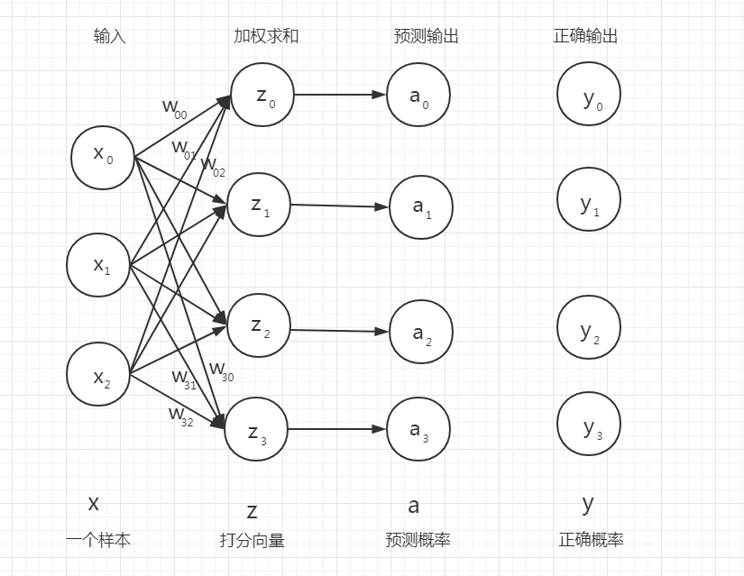

# 矩阵形式的Sigmoid多标签分类模型

## 矩阵形式的Sigmoid多标签分类模型公式表

|模型名称|模型概率输出函数|模型分类决策函数|模型损失函数|模型损失函数的梯度|
|-|-|-|-|-|
|Sigmoid多标签分类模型|$A = \sigma(XW)$|$\hat{Y}=where(A >=0.5, 1, 0)$|$Loss = - \dfrac{1}{m}(sum(Y\odot log (A)+(1-Y) \odot{A} ))$|$\nabla_{w} Loss =\frac{1}{m}{X}^T(A-{Y})$|

## 引言

二分类：表示分类任务中有两个类别，比如我们想识别一幅图片是不是猫。也就是说，训练一个分类器，输入一幅图片，用特征向量x表示，输出是不是猫，用y=0或1表示。二类分类是假设每个样本都被设置了一个且仅有一个标签 0 或者 1。

多类分类: 表示分类任务中有多个类别, 比如对一堆水果图片分类, 它们可能是橘子、苹果、梨等. 多类分类是假设每个样本都被设置了一个且仅有一个标签: 一个水果可以是苹果或者梨, 但是同时不可能是两者。

多标签分类: 给每个样本一系列的目标标签. 可以想象成一个数据点的各属性不是相互排斥的(一个水果既是苹果又是梨就是相互排斥的), 比如一个文档相关的话题. 一个文本可能被同时认为是宗教、政治、金融或者教育相关话题。

在机器学习多分类问题中，常常使用 Sigmoid 函数来作为逻辑回归（二分类模型）的核心函数，但它同时也是多标签分类模型的核心函数。下图是 Sigmoid 多标签分类模型的计算图，当然你也可以把它想象成神经网络的结构图。它代表的意思是，输入一个样例 $x$ 经过打分函数加权求和处理和 Sigmoid 概率输出函数处理就能得到这个样例被分为各个标签的概率值，比如下面图中样例 $x$ 被分为四个标签的概率值分别是 $[a_0,a_1,a_2,a_3]$，分别对应宗教、政治、金融或者教育的概率。一般情况下我们会选取模型预测概率值大于 0.5 的项对应的标签作为该样例的标签。比如这里 $a_0=0.87, a_3=0.91$, 那么属于该样例的标签就是第 $0$ 和 第 $3$ 项对应的标签宗教和教育。

## 多标签分类模型的打分函数和概率输出函数

**打分函数**

当给定一个实例 $x$ 时， Sigmoid 多标签分类模型首先计算实例所属 $k$ 类标签的分数 $z_j(x)$，然后将对分数使用在 Sigmoid 函数上，计算出样例属于各个标签的预测概率值。计算分数 $z_j(x)$ 的公式和线性回归的公式一样，

$$ z_j(x)={w}^T_jx$$

注意，每个标签都有自己独一无二的参数向量 $w_j$，所以的这些向量作为列放在参数矩阵 $W$ 中。

$ z_j(x)= {w}^T_jx$ 向量化，$z(x)$ 就是打分向量

$$z(x)= { \left[
     \begin{matrix}
       z_1(x)\\
       z_2(x)\\
       ···\\
       z_k(x)
      \end{matrix}
      \right] }=W^Tx$$

打分矩阵是，

$z(X)=XW$

**概率输出函数**

$$
a_j(x) = \sigma(z(x))= \sigma({w_j}^Tx)
$$

向量形式的多标签分类模型的概率估计函数：

$$
a(x) = \sigma(z(x))= \sigma({W^Tx)}
$$

Logistic 函数，用 $\sigma(t)$ 表示，其是一个 sigmoid 函数（图像呈 S 型），它的输出是一个介于 0 和 1 之间的数字。sigmoid 逻辑函数定义如下，

$$\sigma(t)=\frac{1}{1+exp(-t)}$$

Sigmoid多标签分类模型根据 $a_j(x) = \sigma({w_j}^Tx)$ 计算出样本 $x$ 属于标签 $j$ 的概率，那然后它很容易得到预测结果 $\hat{y}$。

矩阵形式的Sigmoid多标签分类模型的预测概率函数：

$$
A = a(X) = \sigma(z(X)) = \sigma(XW)
$$

**多标签分类模型的标签分类决策函数**

$$
\hat{y_j} =
\begin{cases}
  0 & \text{if } a_j(x) < 0.5, \\
  1 & \text{if } a_j(x) \geq 0.5.
\end{cases}
$$

注意当 t<0 时 $\sigma(t)<0.5$，当 $t\geq0$ 时 $\sigma(t)\geq0.5$，因此当 ${w_j}^Tx$ 是正数的话，多标签分类模型输出 1，如果它是负数的话，则输出 0。

矩阵形式的Sigmoid多标签分类模型的分类决策函数：

$$\hat{Y}=where(a(X) >=0.5, 1, 0)$$

$\hat{Y}=where(a(X) >=0.5, 1, 0)$ 表示如果预测概率矩阵 $a(X)$ 的某个元素值大于等于 0.5，那么该元素对应位置的 $\hat{Y}$ 元素为 1，否则为 0。

## 多标签分类模型的交叉熵损失函数

一般形式的多标签分类模型的损失函数是交叉熵损失函数，

$$
Loss = - \frac{1}{m} \sum_{i=1}^m \sum_{k=1}^K{\left[ y_k^{(i)} log\left(a_k^{(i)}\right) + (1 - y_k^{(i)}) log\left(1 - a_k^{(i)}\right)\right]}
$$

矩阵形式的多标签分类模型的损失函数，

$$Loss = - \dfrac{1}{m}(sum(Y\odot log (A)+(1-Y) \odot{A} ))$$

也有下面这样等价的函数写法，

$$Loss =-mean(where(Y==1,log(A),log(1-A)))$$

$where(Y==1,log(A),log(1-A))$ 表示如果矩阵 $Y$ 中的元素值为 1，该元素的位置为 $(i,j)$ ，那么保留矩阵 $A$ 中对应位置的元素，反之则用 $1$ 减去该位置元素的值替换掉原来该位置的值。$mean$ 表示求和取平均。

## 多标签分类模型的交叉熵损失函数的梯度

一般形式的多标签分类模型的损失函数是交叉熵损失函数，

$$
Loss = - \frac{1}{m} \sum_{i=1}^m \sum_{k=1}^K{\left[ y_k^{(i)} log\left(a_k^{(i)}\right) + (1 - y_k^{(i)}) log\left(1 - a_k^{(i)}\right)\right]}
$$

有一点要特别注意，就是不同类别标签之间是独立的，也就是说 $\dfrac{\partial loss_i}{\partial w_i}$ 和 $\dfrac{\partial loss_j}{\partial w_j}$ 之间没有联系，$\dfrac{\partial Loss}{\partial w_k}= \dfrac{\partial loss_k}{\partial w_k} $ 根据标签之间的独立性，上面式子可以改写成，

$$
Loss =  \sum_{k=1}^K -\frac{1}{m} \sum_{i=1}^m {\left[ y_k^{(i)} log\left(a_k^{(i)}\right) + (1 - y_k^{(i)}) log\left(1 - a_k^{(i)}\right)\right]}=  \sum_{k=1}^K {loss}_k
$$

其中 ${loss}_k =  - \frac{1}{m} \sum_{i=1}^m {\left[ y_k^{(i)} log\left(a_k^{(i)}\right) + (1 - y_k^{(i)}) log\left(1 - a_k^{(i)}\right)\right]}$ 就是一般的逻辑回归模型的对数损失函数。

现在 ${loss}_k$ 对 $w_k$ 求偏导数，
$$
\begin{aligned}
\dfrac{\partial loss_k}{\partial w_{k}}  &= -\dfrac{1}{m}\sum\limits_{i=1}^{m} \left(
  \frac{y_k^{(i)}}{a_k^{(i)}} -\frac{(1-y_k^{(i)})}{1-a_k^{(i)}} \right)
  \frac{\partial a_k^{(i)}}{\partial z_k^{(i)}}\frac{\partial z_k^{(i)}}{\partial w_k} \\
  &=  -\dfrac{1}{m}\sum\limits_{i=1}^{m}\left( \frac{y_k^{(i)}}{a_k^{(i)}} -\frac{(1-y_k^{(i)})}{1- a_k^{(i)}}  \right)  a_k^{(i)}(1- a_k^{(i)})x^{(i)}\\
  &= \dfrac{1}{m}\sum\limits_{i=1}^{m} (a_k^{(i)}-y_k^{(i)}) x^{(i)}
\end{aligned}
$$

即，一般形式的逻辑回归模型的对数损失函数是，
$$
\dfrac{\partial Loss}{\partial w_k}= \dfrac{\partial loss_k}{\partial w_k}  = \dfrac{1}{m}\sum\limits_{i=1}^{m}\left(a_k^{(i)} - y_k^{(i)}\right)\, x^{(i)}
$$

逻辑回归模型的对数损失函数，它的矩阵形式梯度向量是，

$$
\dfrac{\partial Loss}{\partial w_k} = \frac{1}{m}{X}^T(a_k-y_k)
$$

那么把 $\dfrac{\partial loss_k}{\partial w_k}$ 带回 $\dfrac{\partial Loss}{\partial w}$ 中就有，

$$
\begin{aligned}
\nabla_{W} Loss
&=  [\dfrac{\partial loss_1}{\partial w_1},\dfrac{\partial loss_2}{\partial w_2},..,\dfrac{\partial loss_k}{\partial w_k}]\\
&= [\frac{1}{m}{X}^T(a_1-y_1),\frac{1}{m}{X}^T(a_2-y_2),...,\frac{1}{m}{X}^T(a_k-y_k)] \\
&= \frac{1}{m}{X}^T(a-y)
\end{aligned}
$$

所以，矩阵形式多标签分类模型的交叉熵损失函数的梯度是：

$$\nabla_{W} Loss=\frac{1}{m}{X}^T(A-Y)$$
