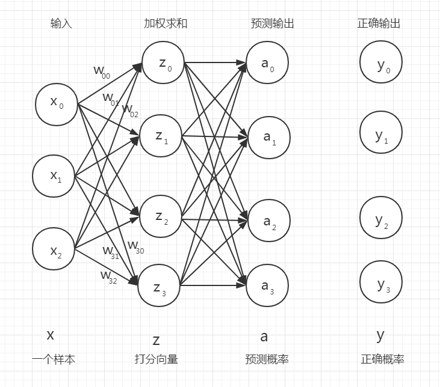
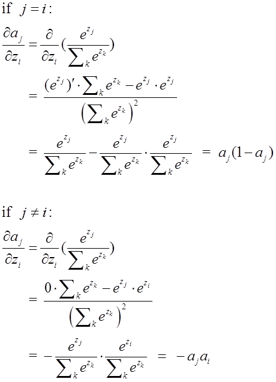

# 矩阵形式的Softmax多分类模型

## 矩阵形式的Softmax多分类模型的公式表

|模型名称|模型概率输出函数|模型分类决策函数|模型损失函数|模型损失函数的梯度|
|-|-|-|-|-|
|Softmax分类模型|$ A =softmax(X W)$|$\hat{Y} =argmax(softmax(XW), axis=0)$|$Loss = - \dfrac{1}{m}(sum(Y\odot log (A)))$|$\nabla_{w} Loss =\frac{1}{m}{X}^T(A-{Y})$|


## 引言

 在机器学习多分类问题中，常常使用 Softmax 函数来作为多分类的核心函数。下图是 Softmax （回归模型）分类器的计算图，当然你也可以把它想象成神经网络的结构图。它代表的意思是，输入一个样例 $x$ 经过打分函数加权求和函数处理和 Softmax 概率输出函数处理就能得到这个样例被分为各个类别的概率值，比如下面图中样例 $x$ 被分为四个类别的概率值分别是 $[a_0,a_1,a_2,a_3]$，一般情况下我们会选取被分类概率最大的那个概率值对应的类别作为样例的预测类别 。



## 为什么要讲此文？矩阵形式的计算公式？

**矩阵形式的 Softmax 分类器的计算公式，包括矩阵形式的分类决策函数计算公式、矩阵形式的损失函数计算公式和矩阵形式的交叉熵损失函数的梯度向量计算公式三大内容（主要是第三个）。**

大家可能觉得 Softmax 回归模型分类器太简单了，大家常常会在书中看到如下的计算式子。但是在实际的运用中，不会直接运用这些函数。


Softmax 回归模型分类器的分类决策函数计算公式：

$$\hat{y}(x) = \text{argmax }  a_j(z)=\text{argmax }z_j(x)=\text{argmax }(x·w)$$

Softmax 回归模型分类器的损失函数计算公式：

$$
Loss = - \frac{1}{m} \sum_{i=1}^m \sum_{k=1}^K y_k^{(i)} \text{log } a_k
$$
交叉熵损失函数梯度向量的计算公式：

$$ \nabla_{w_k} Loss=\frac{1}{m} \sum_{i=1}^m (a_k^{(i)}-y_k^{(i)})x^{(i)}$$

上面的公式有一个有一个求和，那么你要在程序中写一个一个```for```循环？那是非常低效和恐怖的。本文不仅仅一步一步分析了上面的计算式子（如果你只是想了解 Softmax 回归模型分类器原理就足够了，看到矩阵形式证明之前即可）。本文的关键是分析证明了交叉熵损失函数的梯度向量的矩阵形式的计算公式，这才是高效的计算公式，对于想要自己实现 Softmax （回归模型）分类器的读者建议阅读完本文，在下一篇文章中我会给出矩阵形式 Softmax 分类器的实现。


## 矩阵形式的 Softmax 分类器模型

|符号|名称|维度|意义|
|-|-|-|-|
|$X$|样本矩阵|(m,n)| m 个样例向量，每个样例有 n 个特征|
|$W$|权重矩阵|(n,k)| k 个权重向量，每个权重向量有 n 维|
|$A$|概率矩阵|(m,k)| m 个预测概率向量，每个预测向量有 k 维|
|$Y$|标签矩阵|(m,k)| m 个标签向量，每个标签向量有 k 维|
|$\hat{Y}$|预测矩阵|(m,1)|m 个样例对应的类别|

矩阵形式 Softmax 回归模型分类器的分类决策公式：

$$\hat{Y} =argmax(softmax(XW), axis=0)$$


矩阵形式 Softmax 回归模型分类器的概率预测计算公式：

$$ A =softmax(X W), axis=0$$

矩阵形式 Softmax 回归模型分类器的损失函数计算公式：

$$Loss = - \dfrac{1}{m}(sum(Y\odot log (A)))$$

**矩阵形式的交叉熵损失函数的梯度向量计算公式：**

$$
\nabla_{w} Loss = \frac{1}{m}{X}^T(A-{Y})
$$

矩阵形式的交叉熵损失函数的梯度向量计算公式形式优美而简单，随意你取用，更多符号见下文符号定义和预备知识中的符号表。

|模型名称|模型概率输出函数|模型分类决策函数|模型损失函数|模型损失函数的梯度|
|-|-|-|-|-|
|Softmax分类模型|$ A =softmax(X W)$|$\hat{Y} =argmax(softmax(XW), axis=0)$|$Loss = - mean(sum(Y\odot log (A), axis=0))$|$\nabla_{w} Loss =\frac{1}{m}{X}^T(A-{Y})$|


-----

对于矩阵形式 Softmax 回归模型分类器的损失函数计算公式，因为 $sum$ 是对矩阵里面所有元素求和，同样可以通过矩阵运算代替求和运算，

$$Loss = - \dfrac{1}{m}(sum(Y\odot log (A)))$$

定义两个元素全为 1 的特殊向量 $T$ 和 $F$，

|符号|名称|维度|意义|
|-|-|-|-|
|$T$|全一向量T|(1,m)| m 是样本数量|
|$F$|全一向量F|(k,1)| k 是样本所属种类数量|

那么，

$$Loss = - \dfrac{1}{m}(sum(Y\odot log (A)))=- \dfrac{1}{m}T(Y \odot{logA})F$$


## 符号定义和预备知识

**打分函数**

当给定一个实例 $x$ 时， Softmax 回归模型首先计算 $k$ 类的分数 $z_j(x)$，然后将对分数使用 Softmax 函数（也成为归一化指数），估计出每类的概率。计算分数 $z_j(x)$ 的公式和线性回归的公式一样，

$$ z_j(x)={w}^T_jx$$

注意，每个类都有自己独一无二的参数向量 $w_j$，所以的这些向量作为列放在参数矩阵 $W$ 中。

$ z_j(x)= {w}^T_jx$ 向量化，$z(x)$ 就是打分向量

$$z(x)=xW$$

**概率输出函数**

softmax 的函数公式如下：

$$
a_j(z_j) = \frac{e^{z_j}}{\sum_k e^{z_k}},
$$

把上面计算式子的向量形式是， $a(z)$就是概率向量

$$a(z)=\frac{e^{z}}{\sum_k e^{z_k}}$$

**决策函数**

Softmax 回归模型分类器预测结果

$$\hat{y}(x) = \text{argmax }  a_j(z)=\text{argmax }z_j(x)=\text{argmax }(x·w_j)$$

$argmax$ 函数计算返回一个函数值取到最大的变量值。在这个等式中，它返回使 $a_j(z)$ 最大时的第 $k$ 类。简单说就是取 $a(x)$ 向量中最大的那个值对应的类 $k$。

> 注意
> Softmax 回归分类器一次只能预测一个类（即它是多类的，但不是多标签的），因此它只能用于预测判断互斥的类别，如不同类别的植物，但是不用用它来识别一张照片中的多个人。

概率预测函数的向量形式是，

$A =softmax(XW), axis=0$

若要把onehot向量转换成对应的数字，得到模型的决策函数：

$\hat{Y} =argmax(softmax(XW), axis=0)$

## 交叉熵损失函数

Softmax 函数回归模型常用交叉熵损失函数，交叉熵损失函数的计算公式为：

$$
Loss = - \frac{1}{m} \sum_{i=1}^m \sum_{k=1}^K y_k^{(i)} \text{log } a_k^{(i)}
$$

其中，$m$ 是样本的个数， $K$ 是多分类种类的个数， $y_k^{(i)}$ 是标签中样例属于第 $k$ 类的值， $a_k^{(i)}$ 是模型预测 $x^{(i)}$ 属于第 $k$ 类的预测值。

注意，如果对于第 $i$ 个实例的目标类别是 $k$,那么 $y^{(i)}=1$，反之 $y^{(i)}=0$。

可以证明，当只有两个类（$K=2$）时，此时损失函数等同于 Logistic 回归的损失函数（对数损失函数）。

$$
Loss = - \frac{1}{m} \sum_{i=1}^m [y^{(i)} \text{log } a^{(i)}+(1-y^{(i)}) \text{log } (1-a^{(i)}]
$$

矩阵形式的交叉熵损失函数的计算公式为，

$$
\nabla_{w} Loss = \frac{1}{m}{X}^T(A-{Y})
$$


再回顾一下 Softmax 回归模型分类器的计算图


结合上面图片看下面的符号总结表格：

|符号|向量形式|维度|意义
|-|-|-|-|
|$x$|$[x_0,x_1,...,x_n]^T$|(n, 1)|$x$ 表示一个样本实例， $x_i$ 表示向量的第 $i$ 维特征。|
|$X$|$[{(x^{(1)})}^T,{(x^{(2)})}^T,...{(x^{(m)})}^T]$| (m, n)|样本矩阵，一共 $m$ 个样例，每个样例有 $n$ 个特征值，$x^{(i)}$ 表示第 $i$ 个样例。|
|$w_k$|${[w_{k0},w_{k1},...,w_{kn}]}^T$| (n,1)|$w_k$ 表示计算样例属于第 $k$ 类权重系数，$w_{ki}$ 表示向量的第 $i$ 的标量值。|
|$W$|$[w_0,w_1,...,w_k]$|(n,k)|权重矩阵，第 $k$ 列是 $w_k$|
|$z_j(x)$|标量|(1,1)|实例 $x$ 属于第 $j$ 类的分数 $z_k(x)$|
|$z(x)$|$[z_1(x),z_2(x),...,z_k(x)]$|(1,k)|样例 $x$ 被预测为各类的打分向量|
|$a_j(z_j)$|标量|(1,1)|样例$x$ 被预测为第 $j$ 类的概率|
|$a(z)$|${[a_0(z_0),a_1(z_1),...,a_k(z_k)]}^T$|(k,1)|样例 $x$ 被预测为各类的概率向量|
|$A$|${(a^{(1)})}^T,{(a^{(2)})}^T,...{(a^{(m)})}^T]$|(m,k)|预测矩阵|
|${y}^{(i)}_k$|标量|(1,1)|样例真正为第 $k$ 类的概率|
|${y}^{(i)}$|${[{y}^{(i)}_1,{y}^{(i)}_2,...,{y}^{(i)}_k]}^T$|(k,1)|样例真正为各个的类别的概率|
|$Y$|${(y^{(1)})}^T,{(y^{(2)})}^T,...,{(y^{(m)})}^T]$|(m,k)|标签矩阵|
|$\hat{Y}$|${[\hat{y}^{(1)},\hat{y}^{(2)},...,\hat{y}^{(m)}]}^T$|(m,1)|预测矩阵，m 个样例对应的类别|
符号定义规律：一个单独的向量比如 $x$ 一般是列向量,但是把单独的一个向量放进矩阵中时，要把向量先转置。

## 证明：一般形式交叉熵损失函数的梯度向量计算公式

目标： $$ \nabla_{w_k} Loss=\frac{1}{m} \sum_{i=1}^m (a_k^{(i)}-y_k^{(i)})x^{(i)}$$

已知：

$$
Loss = - \frac{1}{m} \sum_{i=1}^m \sum_{k=1}^K y_k^{(i)} \text{log } a_k
$$

其中，$m$ 是样本的个数， $K$ 是多分类种类的个数， $y_k^{(i)}$ 是标签中样例属于第 $k$ 类的值， $a_k^{(i)}$ 是模型预测 $x^{(i)}$ 属于第 $k$ 类的预测值。

如果对于第 $i$ 个实例的目标类别是 $k$,那么 $y^{(i)}=1$，反之 $y^{(i)}=0$。

证明：

首先证明对于一个样本的损失函数的梯度公式，用小写 $loss$ 表示，


$$
loss = -  \sum_{j} y_j \text{log } a_j
$$

$$
 \delta_i = \frac{\partial loss}{\partial z_j} = - \sum_{j} y_j \frac{\partial loss}{\partial a_j} \frac{\partial a_j}{\partial z_i}=- \sum_{j} y_j \frac{ 1}{a_j} \frac{\partial a_j}{\partial z_i}
$$

显然，现在关键目标就是求 $\frac{\partial a_j}{\partial z_i}$，




所以：
$$
\delta_i =- \sum_{j} y_j \frac{ 1}{a_j} \frac{\partial a_j}{\partial z_i}=\sum_{j \neq i}y_ia_i+y_i(a_i-1)
$$

若 $y_i = 0$，则 $\sum_{j \neq i} y_i=1$，$\delta_i=\sum_{j \neq i}y_ia_i=a_i= a_i- y_i$
若 $y_i = 1$，则 $\sum_{j \neq i} y_i=0$，$\delta_i=y_i(a_i-1)=a_i-1=a_i - y_i$

所以无论 $y_i$ 是否等于0，$\delta_i$ 都有同样的表达形式，即：

$$\delta_i =a_i - y_i$$

写成向量形式：

$$\delta =a - y$$

所以，$$\frac{\partial C}{\partial w^l_{jk}} = a^{l-1}_k \delta^l_j=x_k\delta_j=(a_i-y_i)x_k$$


上面的式子只是针对一个样例 $x$ 的损失函数，我们再把 $m$ 样例的损失函数求和取平均就是最终要证明的式子，

$$ \nabla_{w_k} Loss=\frac{1}{m} \sum_{i=1}^m (a_k^{(i)}-y_k^{(i)})x^{(i)}$$

## 证明：矩阵形式交叉熵损失函数的梯度向量计算公式

在上面证明了一般形式交叉熵损失函数的梯度向量计算公式，很容易就可证明矩阵形式交叉熵损失函数的梯度向量计算公式。

还是先看针对一个样例 $x$ 的损失函数，

$$
\frac{\partial loss}{\partial w_{k}}=(a_k-y_k)x
$$

因为，$w$ 的每一列就是一个 $w_k$ 所以，


$$
\begin{aligned}
\nabla_{w} loss &= [\frac{\partial loss}{\partial w_{1}},\frac{\partial loss}{\partial w_{2}},...,\frac{\partial loss}{\partial w_{k}}]
   \\
  &= [(a_1-y_1)x,(a_2-y_2)x,...,(a_k-y_k)x]\\
&= [a_1-y_1,a_2-y_2,...,a_k-y_k]x \\
&= x(a^T-y^T) \\
\end{aligned}
$$

上面的式子只是针对一个样例 $x$ 的损失函数，我们再把 $m$ 样例的损失函数求和取平均就是最终要证明的式子，

$$\nabla_{w} Loss = \frac{1}{m} \sum_{i=1}^m \nabla_{w} {loss}^{(i)} $$

再把上面式子写成矩阵形式，


$$
\begin{aligned}
\nabla_{w} Loss &= \frac{1}{m} \sum_{i=1}^m \nabla_{w} {loss}^{(i)} \\
  &= \frac{1}{m} (\nabla_{w} {loss}^{(1)} + \nabla_{w} {loss}^{(2)} + ··· + \nabla_{w} {loss}^{(m)} )\\
&= \frac{1}{m} [ x^{(1)}({(a^{(1)})}^T-{(y^{(1)})}^T) + x^{(2)}({(a^{(2)})}^T-{(y^{(2)})}^T)+ ··· + x^{(m)}({(a^{(m)})}^T-{(y^{(m)})}^T)]\\
&= \frac{1}{m}{X}^T(A-{Y}) \\
\end{aligned}
$$

矩阵形式交叉熵损失函数的梯度向量计算公式为：

$$
\nabla_{w} Loss = \frac{1}{m}{X}^T(A-{Y})
$$


|符号|名称|维度|意义|
|-|-|-|-|
|$X$|样本矩阵|(m,n)| m 个样例向量，每个样例有 n 个特征|
|$W$|权重矩阵|(n,k)| k 个权重向量，每个权重向量有 n 维|
|$A$|概率矩阵|(m,k)| m 个预测概率向量，每个预测向量有 k 维|
|$Y$|标签矩阵|(m,k)| m 个标签向量，每个标签向量有 k 维|

矩阵形式交叉熵损失函数的梯度向量计算公式，其实更能揭示交叉熵损失函数权重矩阵梯度的本质意义，$A-Y$ 就是模型预测与实际标签的差值，这里可以定义为 $Eerror=A-Y$，正是这些差值驱动着模型不断的调整。很显然，当 $A$ 与 $Y$ 基本相等时， 差值 $Eerror \approx 0$, 那么 $\nabla_{w} Loss = \frac{1}{m}{X}^TError \approx0 $，交叉熵损失函数权重矩阵梯度约等于 0，模型训练完成。

## Softmax分类模型交叉熵损失函数的梯度与线性回归模型均方差损失函数的梯度关系

线性回归模型均方差损失函数的梯度计算公式的矩阵形式为：

$$
\nabla_{\boldsymbol{\theta}} Loss
 = \dfrac{2}{m} \mathbf{X}^T (\mathbf{X} \boldsymbol{\theta} - \mathbf{Y})
$$

令 $A=X\theta$，则，

$$
\nabla_{\boldsymbol{\theta}} Loss
 = \dfrac{2}{m} {X}^T (A - Y)
$$

而由上文可以知道矩阵形式Softmax分类模型 交叉熵损失函数的梯度向量计算公式为：

$$
\nabla_{w} Loss = \frac{1}{m}{X}^T(A-{Y})
$$

是不是有一种直觉，Softmax分类模型交叉熵损失函数的梯度与线性回归模型均方差损失函数的梯度之间肯定有某种关系！具体是什么关系呢？回顾本文开端 Softmax 回归模型分类器，注意回归模型四个字。Softmax分类模型中的概率预测函数 Softmax是个指数型函数，而它的损失函数是一个对数函数，而 $log(e^x)=x$。也许你已经想到了，正是因为模型预测函数和损失函数特殊的对应关系，造成了这种美妙的联系！

|模型名称|模型概率输出函数|模型损失函数|模型损失函数的梯度|
|-|-|-|-|
|Softmax分类模型|$ A =softmax(X W)$|$Loss = - \dfrac{1}{m} (sum(Y\odot log (A)))$|$\nabla_{w} Loss = \dfrac{1}{m}{X}^T(A-{Y})$|
|线性回归模型|$A=X\theta$|$Loss=\dfrac{1}{m}{(A-Y)}^T(A-Y)$|$\nabla_{\boldsymbol{\theta}} Loss= \dfrac{2}{m} {X}^T (A - Y)$|
