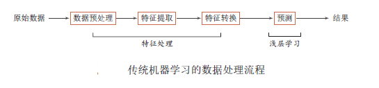
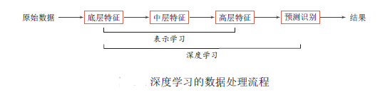
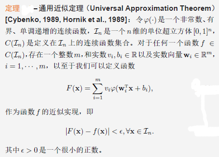
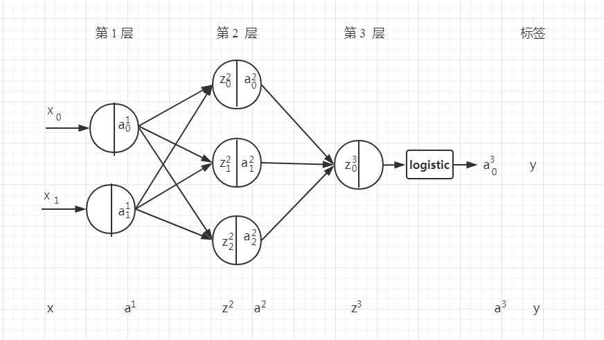
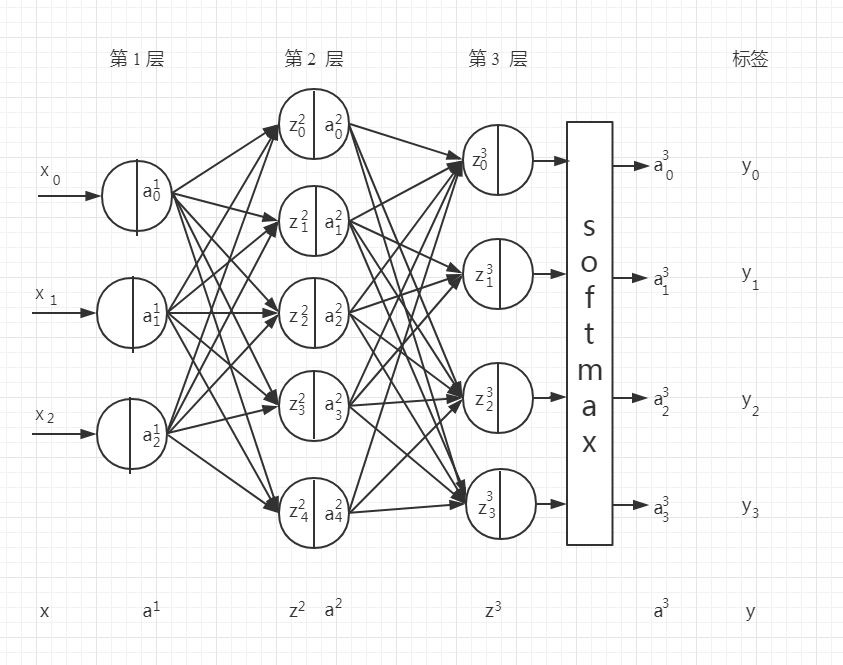
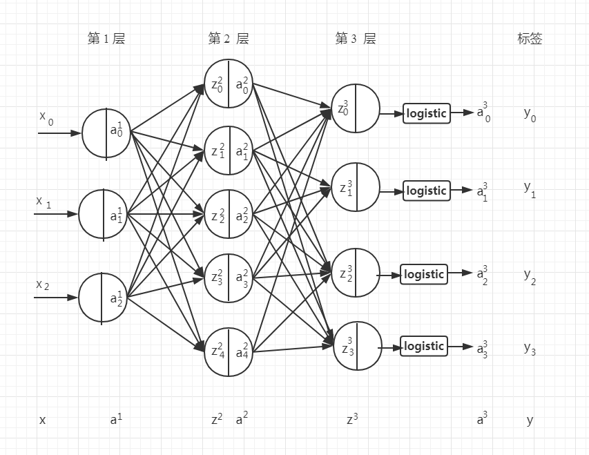
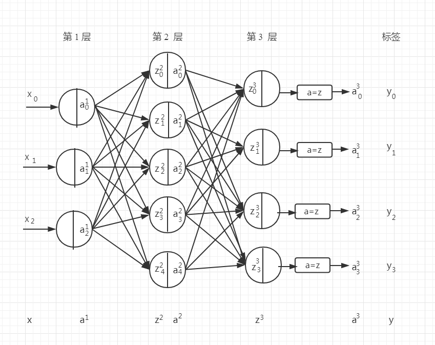

# 矩阵形式的前馈神经网络

## 前馈神经网络的模型图和符号定义

### 前馈神经网络模型图

### 符号表A
|符号|意义|
|-|-|
|$m$|样本个数。|
|$k$|样本标签向量的维度。|
|$d^l$|神经网络第$l$层神经元的个数，又称之为第$$。|
|$\sigma(·)$|是某一种常用的激活函数。比如 sigmoid、tanh 和 ReLu 函数等。|
|$\rho(·)$|神经网络输出层的变换函数。比如 logistic 和 Softmax 函数等。|
|$C$|代价函数。|
|$Loss$|损失函数，意义同 $C$ 。|
|$sum(·)$|求和函数。可以根据矩阵行或列求和，比如 $sum(D, axis=0)$ 就是按照矩阵 $D$ 的行求和。|
|$where(·)$|条件函数。可以根据矩阵元素满足的条件操作，比如 ${Y}=where(A>=0.5, 1, 0)$ 就是若矩阵 $A$ 中元素 $a_{ij}$ 大于等于 0.5 则 $Y$ 矩阵中对应位置元素 $y_{ij}$ 的值取 1 否则取 0。|
|$*$|按矩阵元素乘积。比如 $A * B$。|
|$\odot$|按矩阵元素乘积。比如 $A \odot B$。|

### 符号表B
|符号|向量形式|维度|意义|
|-|-|-|-|
|$x$|$[x_0,x_1,...,x_n]^T$|$(n, 1)$|$x$ 表示一个有 $n$ 维特征样本实例， $x_i$ 表示向量的第 $i$ 维特征。|
|$w_{jk}^{l}$|标量|$(1, 1)$|是从 $l-1$ 层的第 $k$ 个神经元到 $l$ 层的第 $j$ 个神经元的权重。|
|$b_j^l$|标量|$(1, 1)$|是第 $l$ 层的第 $j$ 个神经元的偏置。|
|$z_j^l$|标量|$(1, 1)$|是第 $l$ 层的第 $j$ 个神经元的带权输入。|
|$a_j^l$|标量|$(1, 1)$|是第 $l$ 层的第 $j$ 个神经元的激活值。|
|$y_j$|标量|$(1, 1)$|样本标签向量的第 $j$ 个值。|
|$\hat y_j$|标量|$(1, 1)$|模型预测标签向量的第 $j$ 个值。|
|$\delta_j^l$|标量|$(1, 1)$|是第 $l$ 层的第 $j$ 个神经元的误差值。|
|$z^l$|$[z_0,z_1,...,z_{d^l}]^T$|$(d^l, 1)$|表示第 $l$ 层的带权输入。第 $j$ 个元素是 $z_j^l$。|
|$a^{l}$|$[a_0,a_1,...,a_{d^l}]^T$|$(d^l, 1)$|是激活向量。第 $j$ 行的元素是 $a_j^l$。|
|$b^l$|$[b_0,b_1,...,b_{d^l}]^T$|$(d^l, 1)$|偏置向量，第 $j$ 行的元素是 $b_j^l$|
|$W^{l}$|$\left[\begin{matrix} w_{i1}^l & w_{i2}^l &···& w_{ik}^l & \\ \\w_{j1}^l & w_{j2}^l &···& w_{jk}^l\end{matrix} \right]$|$(d^l, d^{l-1})$|权重矩阵，第 $j$ 行 $k$ 列的元素是 $w_{jk}^{l}$。|
|$\delta^l$|$[\delta_0,\delta_1,...,\delta_{d^l}]^T$|$(d^l, 1)$|是误差向量，$\delta^l$ 的第 $j$ 个元素是 $\delta_j^l$。|
|$z^{v,l}$|$[z_0,z_1,...,z_{d^l}]^T$|$(d^l, 1)$|表示神经网络第 $l$ 层的小批量样本中的第 $v$ 个样本的带权输入向量。|
|$a^{v,l}$|$[a_0,a_1,...,a_{d^l}]^T$|$(d^l, 1)$|表示神经网络第 $l$ 层的小批量样本中的第 $v$ 个样本的激活向量。|
|$\delta^{v,l}$|$[\delta_0,\delta_1,...,\delta_{d^l}]^T$|$(d^l, 1)$|表示神经网络第 $l$ 层的小批量样本中的第 $v$ 个样本的误差。|
|$y$|$[y_0,y_1,...,y_{k}]^T$|$(k, 1)$|标签向量，第 $j$ 个值是 $y_j$。|
|$\hat y$|$[\hat y_0,\hat y_1,...,\hat y_{k}]^T$|$(k, 1)$|模型的标签向量，第 $j$ 个值是 $\hat y_j$。|
|$X$|$[{(x^{(1)})}^T,{(x^{(2)})}^T,...,{(x^{(m)})}^T]^T$|$(m, n)$|样本矩阵，第 $i$ 行是第 $i$ 个样本向量 $x^{(i)}$ 的转置。|
|$Y$|$[{(y^{(1)})}^T,{(y^{(2)})}^T,...,{(y^{(m)})}^T]^T$|$(m, k)$|标签矩阵，第 $i$ 行是第 $i$ 个标签向量 $y^{(i)}$ 的转置。|
|$\hat Y$|$[{(\hat y^{(1)})}^T,{(\hat y^{(2)})}^T,...,{(\hat y^{(m)})}^T]^T$|$(m, k)$|估计的标签矩阵，第 $i$ 行是第 $i$ 个标签向量 $\hat y^{(i)}$ 的转置。|
|$Z^l$|$[{(z^{1,l})}^T,{(z^{2,l})}^T,...,{(z^{m,l})}^T]^T$|$(m, d^l)$|带权输入矩阵，第 $v$ 行是第 $v$ 个样本在第 $l$ 层的带权输入向量 $z^{v,l}$ 的转置。|
|$A^l$|$[{(a^{1,l})}^T,{(a^{2,l})}^T,...,{(a^{m,l})}^T]^T$|$(m, d^l)$|激活矩阵，第 $v$ 行是第 $v$ 个样本在第 $l$ 层的激活向量 $a^{v,l}$ 的转置。|
|$\Delta^l$|$[{(\delta^{1,l})}^T,{(\delta^{2,l})}^T,...,{(\delta^{m,l})}^T]^T$|$(m, d^l)$|误差矩阵，第 $v$ 行是第 $v$ 个样本在第 $l$ 层的误差向量 $\delta^{v,l}$ 的转置。|

## 前向传播算法的基本公式

|计算公式|维度变化|
|-|-|
|$a^1=x$|$(n, 1) = (n, 1)$|
|$z^l = W^l a^{l-1}+b^l$|$({d}^l, 1) =({d}^{l}, {d}^{l-1}) (d^{l-1}, 1) + (d^l, 1)$|
|$a^{l} =\sigma{(z^{l})}$|$(d^l, 1) = (d^l, 1)$|
|$a^{L} =\varphi(z^{L})$|$(?, 1) \leftarrow (d^L, 1)$|
|$\hat{y}=\rho(a^L)$|$(?, 1) \leftarrow (?, 1)$|

前馈神经网络可以通过逐层信息传递，得到网络最后的输出 $a^L$。整个网络可以看做一个复合函数 $\varphi(x;W,b)$，将向量 $x$ 作为第一层的输入 $a^1$，将第 $L$ 层的输出 $a^L$ 作为整个函数的输出。

$$x = a^1 \rightarrow z^2 \rightarrow a^2 \rightarrow ··· \rightarrow a^{L-1} \rightarrow z^L \rightarrow a^L=\varphi(x;W,b)$$

其中 $W, b$ 表示网络中所有层的连接权重和偏置。

## 矩阵形式前向传播算法的计算公式

|计算公式|维度变化|
|-|-|
|$A^1=X$|$(m, n) = (m, n)$|
|$Z^l=A^{l-1}{(W^{l})}^T + {(b^l)}^T$|$(m, {d}^l) = (m, {d}^{l-1}) {({d}^{l}, {d}^{l-1})}^T + {(d^{l},1)}^T$|
|$A^l=\sigma(Z^l)$|$(m, d^l) = (m, d^l)$|
|$A^L=\varphi(Z^L)$|$(m, ?) \leftarrow (m, d^L)$|
|$\hat{Y}=\rho(A^L)$|$(m, ?) \leftarrow (m, ?)$|

矩阵形式前向传播算法的计算公式不过是把原来的向量 $x$ 装进了矩阵 $X$ 当中，网络最终的输出变成了 $A^L$。整个网络仍然可以看做一个复合函数 $\varphi(X;W,b)$。

$$X = A^1 \rightarrow Z^2 \rightarrow A^2 \rightarrow ··· \rightarrow A^{L-1} \rightarrow Z^L \rightarrow A^L=\varphi(X;W,b)$$

其中 $W, b$ 表示网络中所有层的连接权重和偏置。

## 反向传播算法的四个基本公式

有关反向传播算法的理解和证明见[《反向传播算法》](反向传播算法.md)

|计算公式|维度变化|
|-|-|
|$\delta^L =\nabla_a C\odot \dfrac{\partial \varphi^{(L)}}{\partial z^L} $|$(d^L, 1) = (d^L, 1) * (d^L, 1)$|
|$\delta^{(l)} =({(W^{(l+1)})}^T\delta^{(l+1)})\odot \sigma'(z^l) $|$(d^l, 1) = {({d}^{l+1}, {d}^{l})}^T (d^{l+1}, 1) * (d^l, 1)$|
|$\dfrac{\partial C}{\partial b^{(l)}} =\delta^{(l)}$|$(d^l, 1) = (d^l, 1)$|
|$\dfrac{\partial C}{\partial W^l} = \delta^l (a^{l-1})^T $|$(d^l, d^{l-1}) = (d^l,1) {(d^{l-1}, 1)}^T$|

对于代价函数函数有两种写法 $C$ 和 $Loss$，它两在本文中是一个意思。

## 矩阵形式反向传播四个基本公式

反向传播算法对一个训练样本计算代价函数的梯度，$C=C_x$。在实践中，通常将反向传播算法和诸如随机梯度下降这样的学习算法进行组合使用，我们会对许多训练样本计算对应的梯度。特别地，给定一个大小为 m 的小批量数据，下面的算法在这个小批量数据的基础上应用梯度下降学习算法：

下面给出矩阵形式的反向传播算法：

|计算公式|维度变化|
|-|-|
|$\Delta^L =\nabla_{A^L} C\odot \dfrac{\partial \varphi^{(L)}}{\partial Z^L}$|$(m, d^L) = (m, d^L) * (m, d^L)$|
|$\Delta^{l} =(\Delta^{l+1}W^{l+1})\odot \sigma'(Z^l)$|$(m, {d}^l) = (m, {d}^{l+1}) ({d}^{l+1}, {d}^l)$|
|$\dfrac{\partial C}{\partial b^{(l)}} =\dfrac{1}{m}{(sum(\Delta^l, axis=0))}^T$|$(d^l, 1) = {(1, d^l)}^T$|
|$\dfrac{\partial C}{\partial W^{(l)}} =\dfrac{1}{m}{(\Delta^l)}^TA^{l-1} $|$(d^{l}, d^{l-1}) = {(m, d^l)}^T(m, d^{l-1})$|

## 前馈神经网络与传统机器学习算法的关系

### 从理论上的分析

目前大部分的机器学习算法是将特征处理（即前三步）和预测分开的，并且主要关注于最后一步，即构建预测函数。但是实际操作过程中，不同预测模型的性能相差不多，而前三步中的特征处理对最终系统的准确性有着十分关键的作用。由于特征处理一般都需要人工干预完成，利用人类的经验来选取好的“特征”，并最终提高机器学习系统的性能。因此，很多的模式识别问题变成了特征工程（Feature Engineering）问题。开发一个机器学习系统的主要工作量都消耗在了预处理和特提取以及征转换上。

在处理好特征后，传统机器学习模型主要关注于分类或预测。这类机器学习称为浅层学习（Shallow Learning）。浅层学习的一个重要特点是不涉及特征学习，其特征主要靠人工经验或特征转换方法来抽取。

为了提高机器学习系统的准确率，我们就需要将输入信息转换为有效的特征（feature），也叫表示（representation）。如果有一种算法可以自动地学习出有效的特征，并提高最终分类器的性能，那么这种学习就是可以叫做表示学习（Representation Learning）。

深度学习（Deep Learning，DL）是指如何从数据中学习一个“深度模型”的问题，是机器学习的一个子问题。通过构建具有一定“深度”的模型，可以让模型来自动学习好的特征表示（从底层特征，到中层特征，再到高层特征），从而最终提升预测或识别的准确性。下图给出了深度学习的数据处理流程。

深度学习的主要目的是从数据中自动学习到有效的特征，即表示学习。深度学习技术在一定程度上可以看作是一个表示学习技术，通过多层的非线性转换，把原始数据变成为更高层次、更抽象的表示。这些学习到的表示可以替代人工设计的特征，从而避免“特征工程”。

### 从数学层面的分析

前馈神经网络具有很强的拟合能力，常见的连续非线性函数都可以用前馈神经网络来近似。

根据通用近似定理，神经网络在某种程度上可以作为一个“万能”函数来使用，可以用来进行复杂的特征转换，或逼近一个复杂的条件分布。在机器学习中，输入样本的特征对分类器的影响很大。以监督学习为例，好的特征可以极大提高分类器的性能。因此，要取得好的分类效果，需要样本的原始特征向量x 转换到更有效的特征向量φ(x)，这个过程叫做特征抽取。

多层前馈神经网络可以看作是一个非线性复合函数$\varphi: R^p\rightarrow R^q$，将输入$x\in R^p$ 映射到输出 $\varphi(x)\in R^q$。因此，多层前馈神经网络也可以看成是一种特征转换方法，其输出 $\varphi(x)$ 作为分类器的输入进行分类。

给定一个训练样本(x, y)，先利用多层前馈神经网络将x 映射到φ(x)，然后再将φ(x) 输入到分类器 $\rho(·)$ 。其中 $\rho(·)$ 为线性或非线性的分类器，$\theta$ 为分类器 $\rho(·)$ 的参数，$\hat y$ 为分类器的输出。

$$\hat y = \rho(\varphi(x), \theta)$$

特别地，如果分类器g(·) 为 logistic 回归分类器或softmax 回归分类器，那么 g(·) 也可以看成是网络的最后一层，即神经网络直接输出不同类别的后验概率。

对于两类分类问题y 2 {0, 1}，并采用logistic 回归，那么 logistic 回归分类器可以看成神经网络的最后一层。也就是说，网络的最后一层只用一个神经元，并且其激活函数为logistic 函数。网络的输出可以直接可以作为两个类别的后验概率。

$$p(y=1|x)=a^{(L)}$$

其中 $a^{(L)}\in R$ 为第 L 层神经元的激活值。

对于多类分类问题 $y\in \{1,2,...,K \}$，如果使用 softmax 回归分类器，相当于网络最后一层设置 K 个神经元，其输出经过softmax 函数进行归一化后可以作为每个类的后验概率。

$$\hat y=softmax(z^{(L)})$$

其中 $z^{(L)}\in R$ 为第 L 层神经元的带权输入，$\hat y\in R^K$ 为第 L 层神经元的激活值，分别表示不同类别标签的预测后验概率。

反之，logistic 回归或 softmax 回归也可以看作是只有一层的神经网络。

### 深度学习的优势

在一些复杂的模式识别任务中，传统机器学习方法需要将一个模式识别任务的输入和输出之间人为地切割成很多子模块（或多个阶段），每个子模块分开学习。比如一个自然语言理解任务，一般需要分词、词性标注、句法分析、语义分析、语义推理等步骤。这种学习方式有两个问题：一是每一个模块都需要单独优化，并且其优化目标和任务总体目标并不能保证一致。二是错误传播，即前一步的错误会对后续的模型造成很大的影响。这样就增加了机器学习方法在实际应用的难度。

端到端学习（End-to-End Learning），也称端到端训练，是指在学习过程中不进行分模块或分阶段进行训练，直接优化任务的总体目标。在端到端学习中，一般不需要明确地给出不同模块或阶段的功能，中间过程不需要人为干预。端到端学习的训练数据为“输入-输出”对的形式，无需提供其它额外信息。因此，端到端学习和深度学习一样，都是要解决“贡献度分配”问题。

## 神经网络应用到逻辑回归

机器学习中矩阵形式的逻辑回归模型计算公式如下：

|模型名称|模型概率输出函数|模型的分类决策函数|模型损失函数|模型损失函数的梯度|
|-|-|-|-|-|
线性回归模型|$\hat{P} = \sigma(\boldsymbol X\theta)$|$\hat{Y}=where(\hat{P}>=0.5, 1, 0)$|$J(\boldsymbol{\theta}) =-\dfrac{1}{m}[Y^T log(\hat{P})+(1-Y^T)log(1-\hat{P})]$|$\nabla_{w} Loss = \frac{1}{m}{X}^T(P-Y)$|

关于上面内容的具体分析见[《矩阵形式的逻辑回归模型》](矩阵形式的逻辑回归模型.md)，下面根据神经网络的符号和定义对上面的符号做一些修改，本质上是一致的。

神经网络中的逻辑回归模型：

|模型名称|模型概率输出函数|模型的分类决策函数|
|-|-|-|
神经网络线性回归模型|$A^{L} = logistic(Z^{L})$|$\hat{Y}=where(A^{L}>=0.5, 1, 0)$|

|模型损失函数|模型输出层损失函数的梯度|
|-|-|
|$Loss =-\dfrac{1}{m}[Y^T log(A^{L})+(1-Y^T)log(1-A^{L})]$|$\Delta^{L} = A^{(L)}-Y$|

### 逻辑回归实例分析

针对该例子的符号说明如下：

|符号|维度|意义|
|-|-|-|
|$X$|(m,2)|样本矩阵|
|$W^2$|(3,2)|第二层的权重矩阵|
|$W^3$|(1,3)|第三层的权重矩阵|
|$b^2$|(3,1)|第二层的偏置矩阵|
|$b^3$|(1,1)|第三层的偏置矩阵|
|$Z^2$|(m,3)|第二层的带权输入矩阵|
|$Z^3$|(m,1)|第三层的带权输入矩阵|
|$A^1$|(m,2)|第一层的激活矩阵|
|$A^2$|(m,3)|第二层的激活矩阵|
|$A^3$|(m,1)|第三层的激活矩阵|
|$\hat Y$|(m,1)|输出矩阵|
|$Y$|(m,1)|标签矩阵|

**前向传播过程**

|计算公式|维度变化|
|-|-|
|$A^1=X$|$(m, 2) = (m, 2)$|
|$Z^2=A^1{(W^2)}^T + {(b^2)}^T$|$(m, 3) = (m, 2) {(3, 2)}^T + {(3, 1)}^T$|
|$A^2=\sigma(Z^2)$|$(m, 3) = (m, 3)$|
|$Z^3=A^2{(W^3)}^T + {(b^3)}^T$|$(m, 1) = (m, 3) {(3, 1)}^T + {(1, 1)}^T$|
|$A^3=sigmoid(Z^3)$|$(m, 1) = (m, 1)$|
|$\hat{Y}=where(A^{(3)} >= 0.5, 1, 0)$|$(m, 1) = (m, 1)$|

**反向传播过程**

|计算公式|维度变化|
|-|-|
|$\Delta^3=A^3-Y$|$(m, 1) = (m, 1) - (m, 1)$|
|$\dfrac{\partial C}{\partial b^{3}} =\dfrac{1}{m}{(sum(\Delta^3, axis=0))}^T $|$(1, 1) = {(1, 1)}^T$|
|$\dfrac{\partial C}{\partial W^{3}} =\dfrac{1}{m}{(\Delta^3)}^TA^{2} $|$(1, 3) = {(m, 1)}^T (m, 3)$|
|$\Delta^{2} =(\Delta^{3}W^{3})\odot \sigma'(Z^2) $|$(m, 3) = ((m, 1) (1, 3)) * (m, 3)$|
|$\dfrac{\partial C}{\partial b^{2}} =\dfrac{1}{m}{(sum(\Delta^2, axis=0))}^T $|$(3, 1) = {(1, 3)}^T$|
|$\dfrac{\partial C}{\partial W^{2}} =\dfrac{1}{m}{(\Delta^2)}^TA^{1} $|$(3, 2) = {(m, 3)}^T (m, 2)$|

## 神经网络应用到 Softmax 多分类模型

|模型名称|模型概率输出函数|模型分类决策函数|模型损失函数|模型损失函数的梯度|
|-|-|-|-|-|
|Softmax分类模型|$ A =softmax(X W)$|$\hat{Y} =argmax(softmax(XW), axis=0)$|$Loss = - \dfrac{1}{m}(sum(Y\odot log (A)))$|$\nabla_{W} Loss =\frac{1}{m}{X}^T(A-{Y})$|

关于上面内容的具体分析见[《矩阵形式的Softmax多分类模型》](矩阵形式的Softmax多分类模型.md)，下面根据神经网络的符号和定义对上面的符号做一些修改，本质上是一致的。

神经网络应用到 Softmax 多分类模型，

|模型名称|模型概率输出函数|模型分类决策函数|
|-|-|-|
|神经网络Softmax分类模型|$ A^L=softmax(Z^L)$|$\hat{Y} =argmax(A^L, axis=0)$|

|模型损失函数|模型输出层损失函数的梯度|
|-|-|
|$Loss = - \dfrac{1}{m}(sum(Y\odot log (A^L)))$|$\Delta^{(L)} = A^{(L)}-Y$|

### Softmax 回归实例分析

针对该例子的符号说明如下：

|符号|维度|意义
|-|-|-|
|$X$|(m,3)|样本矩阵|
|$W^2$|(5,3)|第二层的权重矩阵|
|$W^3$|(4,5)|第三层的权重矩阵|
|$b^2$|(5,1)|第二层的偏置矩阵|
|$b^3$|(4,1)|第三层的偏置矩阵|
|$Z^2$|(m,5)|第二层的带权输入矩阵|
|$Z^3$|(m,4)|第三层的带权输入矩阵|
|$A^1$|(m,3)|第一层的激活矩阵|
|$A^2$|(m,5)|第二层的激活矩阵|
|$A^3$|(m,4)|第三层的激活矩阵|
|$\hat Y$|(m,1)|输出矩阵|
|$Y$|(m,1)|标签矩阵|

**前向传播过程**

|计算公式|维度变化|
|-|-|
|$A^1=X$|$(m, 3) = (m, 3)$|
|$Z^2=A^1{(W^2)}^T + {(b^2)}^T$|$(m, 5) = (m, 3) {(5, 3)}^T + {(5, 1)}^T$|
|$A^2=\sigma(Z^2)$|$(m, 5) = (m, 5)$|
|$Z^3=A^2{(W^3)}^T + {(b^3)}^T$|$(m, 4) = (m, 5){(4, 5)}^T + {(4, 1)}^T$|
|$A^3=softmax(Z^3)$|$(m, 4) = (m, 4)$|
|$\hat{Y} =argmax(A^3, axis=0)$|$(m, 1) = (m, 1)$|

**反向传播过程**

|计算公式|维度变化|
|-|-|
|$\Delta^3=A^3-Y$|$(m, 4) = (m, 4) - (m, 4)$|
|$\dfrac{\partial C}{\partial b^{3}} =\dfrac{1}{m}{(sum(\Delta^3, axis=0))}^T $|$(4, 1) = {(1, 4)}^T$|
|$\dfrac{\partial C}{\partial W^{3}} =\dfrac{1}{m}{(\Delta^3)}^TA^{2} $|$(4, 5) = {(m, 4)}^T (m, 5)$|
|$\Delta^{2} =(\Delta^{3}W^{3})\odot \sigma'(Z^2) $|$(m, 5) = ((m, 4) (4, 5)) * (m, 5)$|
|$\dfrac{\partial C}{\partial b^{2}} =\dfrac{1}{m}{(sum(\Delta^2, axis=0))}^T $|$(5, 1) = {(1, 5)}^T$|
|$\dfrac{\partial C}{\partial W^{2}} =\dfrac{1}{m}{(\Delta^2)}^TA^{1} $|$(5, 3) = {(m, 5)}^T (m, 3)$|

## 神经网络应用到 logistic 多标签分类模型

|模型名称|模型概率输出函数|模型分类决策函数|模型损失函数|模型损失函数的梯度|
|-|-|-|-|-|
|Sigmoid多标签分类模型|$A = \sigma(XW)$|$\hat{Y}=where(A >=0.5, 1, 0)$|$Loss = - \dfrac{1}{m}(sum(Y\odot log (A)+(1-Y) \odot{A} ))$|$\nabla_{W} Loss =\frac{1}{m}{X}^T(A-{Y})$|

关于上面内容的具体分析见[《矩阵形式的Sigmoid多标签分类模型》](矩阵形式的Sigmoid多标签分类模型.md)，下面根据神经网络的符号和定义对上面的符号做一些修改，本质上是一致的。

神经网络应用到 logistic 多标签分类模型，

|模型名称|模型概率输出函数|模型分类决策函数|
|-|-|-|
|神经网络Logistic多标签分类模型|$ A^L=logistic(Z^L)$|$\hat{Y}=where(A^L >=0.5, 1, 0), axis=0$|

|模型损失函数|模型输出层损失函数的梯度|
|-|-|
|$Loss = - \dfrac{1}{m}(sum(Y\odot log (A^L)))$|$\Delta^{(L)} = A^{(L)}-Y$|

### logistic 多标签分类实例分析

针对该例子的符号说明如下：

|符号|维度|意义
|-|-|-|
|$X$|(m,3)|样本矩阵|
|$W^2$|(5,3)|第二层的权重矩阵|
|$W^3$|(4,5)|第三层的权重矩阵|
|$b^2$|(5,1)|第二层的偏置矩阵|
|$b^3$|(4,1)|第三层的偏置矩阵|
|$Z^2$|(m,5)|第二层的带权输入矩阵|
|$Z^3$|(m,4)|第三层的带权输入矩阵|
|$A^1$|(m,3)|第一层的激活矩阵|
|$A^2$|(m,5)|第二层的激活矩阵|
|$A^3$|(m,4)|第三层的激活矩阵|
|$\hat Y$|(m,1)|输出矩阵|
|$Y$|(m,1)|标签矩阵|

**前向传播过程**

|计算公式|维度变化|
|-|-|
|$A^1=X$|$(m, 3) = (m, 3)$|
|$Z^2=A^1{(W^2)}^T + {(b^2)}^T$|$(m, 5) = (m, 3) {(5, 3)}^T + {(5, 1)}^T$|
|$A^2=\sigma(Z^2)$|$(m, 5) = (m, 5)$|
|$Z^3=A^2{(W^3)}^T + {(b^3)}^T$|$(m, 4) = (m, 5){(4, 5)}^T + {(4, 1)}^T$|
|$A^3=logistic(Z^3), axis=0$|$(m, 4) = (m, 4)$|
|$\hat{Y}=where(A >=0.5, 1, 0), axis=0$|$(m, 4) = (m, 4)$|

**反向传播过程**

|计算公式|维度变化|
|-|-|
|$\Delta^3=A^3-Y$|$(m, 4) = (m, 4) - (m, 4)$|
|$\dfrac{\partial C}{\partial b^{3}} =\dfrac{1}{m}{(sum(\Delta^3, axis=0))}^T $|$(4, 1) = {(1, 4)}^T$|
|$\dfrac{\partial C}{\partial W^{3}} =\dfrac{1}{m}{(\Delta^3)}^TA^{2} $|$(4, 5) = {(m, 4)}^T (m, 5)$|
|$\Delta^{2} =(\Delta^{3}W^{3})\odot \sigma'(Z^2) $|$(m, 5) = ((m, 4) (4, 5)) * (m, 5)$|
|$\dfrac{\partial C}{\partial b^{2}} =\dfrac{1}{m}{(sum(\Delta^2, axis=0))}^T $|$(5, 1) = {(1, 5)}^T$|
|$\dfrac{\partial C}{\partial W^{2}} =\dfrac{1}{m}{(\Delta^2)}^TA^{1} $|$(5, 3) = {(m, 5)}^T (m, 3)$|

## 神经网络应用到多元回归模型

|模型名称|模型输出函数|模型损失函数|模型损失函数的梯度|
|-|-|-|-|
线性回归模型|$A=X\theta$|$Loss=\frac{1}{m}{\Vert A^L-Y \Vert}^2$|$\nabla_{\boldsymbol{\theta}} Loss= \dfrac{2}{m} {X}^T (A - Y)$|

关于上面内容的具体分析见[《矩阵形式的线性回归模型》](矩阵形式的线性回归模型.md)，下面根据神经网络的符号和定义对上面的符号做一些修改，本质上是一致的。有一点需要注意的是，由于神经网络中使用了非线性的激活函数，所以神经网络有了拟合非线性函数的能力，所以这里是神经网络应用到多元回归模型，而不仅仅是神经网络应用到多元线性回归模型。

神经网络应用到多元回归模型，

|模型名称|模型输出函数|模型损失函数|模型输出层损失函数的梯度|
|-|-|-|-|
|神经网络多元回归模型|$\hat Y=A^L$|$Loss=\frac{1}{m}{\Vert A^L-Y \Vert}^2$|$\Delta^{(L)}= 2(A - Y)$|

**多元回归模型实例分析**

针对该例子的符号说明如下：

|符号|维度|意义
|-|-|-|
|$X$|(m,3)|样本矩阵|
|$W^2$|(5,3)|第二层的权重矩阵|
|$W^3$|(4,5)|第三层的权重矩阵|
|$b^2$|(5,1)|第二层的偏置矩阵|
|$b^3$|(4,1)|第三层的偏置矩阵|
|$Z^2$|(m,5)|第二层的带权输入矩阵|
|$Z^3$|(m,4)|第三层的带权输入矩阵|
|$A^1$|(m,3)|第一层的激活矩阵|
|$A^2$|(m,5)|第二层的激活矩阵|
|$A^3$|(m,4)|第三层的激活矩阵|
|$\hat Y$|(m,1)|输出矩阵|
|$Y$|(m,1)|标签矩阵|

**前向传播过程**

|计算公式|维度变化|
|-|-|
|$A^1=X$|$(m, 3) = (m, 3)$|
|$Z^2=A^1{(W^2)}^T + {(b^2)}^T$|$(m, 5) = (m, 3) {(5, 3)}^T + {(5, 1)}^T$|
|$A^2=\sigma(Z^2)$|$(m, 5) = (m, 5)$|
|$Z^3=A^2{(W^3)}^T + {(b^3)}^T$|$(m, 4) = (m, 5){(4, 5)}^T + {(4, 1)}^T$|
|$A^3=Z^3$|$(m, 4) = (m, 4)$|
|$\hat Y = A^3$|$(m, 4) = (m, 4)$|

**反向传播过程**

|计算公式|维度变化|
|-|-|
|$\Delta^3=A^3-Y$|$(m, 4) = (m, 4) - (m, 4)$|
|$\dfrac{\partial C}{\partial b^{3}} =\dfrac{1}{m}{(sum(\Delta^3, axis=0))}^T $|$(4, 1) = {(1, 4)}^T$|
|$\dfrac{\partial C}{\partial W^{3}} =\dfrac{1}{m}{(\Delta^3)}^TA^{2} $|$(4, 5) = {(m, 4)}^T (m, 5)$|
|$\Delta^{2} =(\Delta^{3}W^{3})\odot \sigma'(Z^2) $|$(m, 5) = ((m, 4) (4, 5)) * (m, 5)$|
|$\dfrac{\partial C}{\partial b^{2}} =\dfrac{1}{m}{(sum(\Delta^2, axis=0))}^T $|$(5, 1) = {(1, 5)}^T$|
|$\dfrac{\partial C}{\partial W^{2}} =\dfrac{1}{m}{(\Delta^2)}^TA^{1} $|$(5, 3) = {(m, 5)}^T (m, 3)$|
