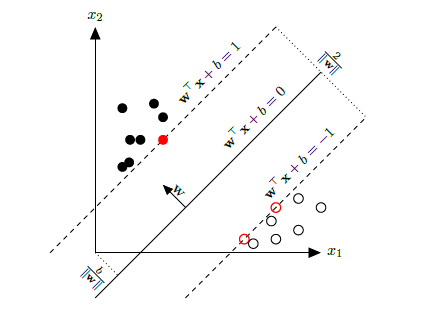

# 矩阵形式的支持向量机模型

## 矩阵形式的支持向量机模型的公示表和符号表

### 公示表
|模型名称|模型分类决策函数|模型损失函数|模型损失函数的梯度 $\frac{\partial Loss}{\partial W}$|模型损失函数的梯度 $\frac{\partial Loss}{\partial b}$|
|-|-|-|-|-|
|支持向量机|$\hat{Y}=where(XW+b \geq 0, 1, 0)$|$Loss = \frac{1}{2}W^TW+C·sum(max[0, 1-(XW+b) \odot Y])$|$w - \frac{C}{m}sum(Y_{sv}\odot X_{sv}, axis=0)$|$\dfrac{\partial Loss}{\partial b} =  - \frac{C}{m}sum(Y_{sv})$|

### 符号表
|符号|向量形式|维度|意义
|-|-|-|-|
|$x$|$[x_0,x_1,...,x_n]^T$|(n, 1)|$x$ 表示一个样本实例， $x_i$ 表示向量的第 $i$ 维特征。|
|$X$|$[{(x^{(1)})}^T,{(x^{(2)})}^T,...{(x^{(m)})}^T]$| (m,n)|样本矩阵，一共 $m$ 个样例，每个样例有 $n$ 个特征值，$x^{(i)}$ 表示第 $i$ 个样例。|
|$w$|标量|(1, 1)|$w$ 表示权重。|
|$b$|标量|(1, 1)|$b$ 表示偏置。|
|$W$|${[w_{0},w_{1},...,w_{n}]}^T$|(n,1)|权重矩阵，$w_i$表示第$i$维的权重。|
|$y$|标量|(1,1)|样例的类别，1 为正类， -1 负类|
|$\hat y$|标量|(1,1)|预测样例的类别，1 为正类， -1 负类|
|$Y$|$[y^{(1)},y^{(2)},...,y^{(m)}]$|(m,1)|标签矩阵|
|$\hat{Y}$|$[\hat{y}^{(1)},\hat{y}^{(2)},...,\hat{y}^{(m)}]$|(m,1)|预测矩阵，m 个样例对应的类别|

符号定义规则：一个单独的向量比如 $x$ 一般是列向量，但是把单独的一个向量放进矩阵中时，要把向量先转置。

## 支持向量机模型

支持向量机（Support Vector Machine，SVM）是一个经典两类分类算法，其找到的分割超平面具有更好的鲁棒性，因此广泛使用在很多任务上，并表现出了很强优势。

给定一个两类分类器数据集 $D = {\{x(n), y(n)\}}^m_{i=1}, y_i\in P{\{+1, -1\}}$如果两类样本是线性可分的，即存在一个超平面

$$w^Tx + b = 0 $$

将两类样本分开，那么对于每个样本都有 $y^{(i)}(w^Tx^{(i)}+b) \geq 0$。

## 支持向量机的预测函数

一般形式的支持向量机的预测函数：

$$
\hat{y}^{(i)} =
\begin{cases}
  0 & \text{if } w^{*T}x^{(i)}+b^{*} < 0, \\
  1 & \text{if } w^{*T}x^{(i)}+b^{*} \geq 0.
\end{cases}
$$

其中 $w^{*}, b^{*}$ 是支持向量机模型学习所得的最优超平面参数。

矩阵形式的支持向量机预测函数：

$$\hat{Y}=where(XW+b \geq 0, 1, 0)$$

$\hat{Y}=where(XW+b \geq 0, 1, 0)$ 表示如果预测概率矩阵 $XW+b \geq 0$ 的某个元素值大于等于 0，那么该元素对应位置的 $\hat{Y}$ 元素为 1，否则为 0。

## 支持向量机的损失函数

一般形式的支持向量机的（合页）损失函数，

$$
Loss =\frac{1}{2}{||w||}^2 + C · \sum_{i=1}^m max(0, 1-y^{(i)}(w^Tx^{(i)}+b))
$$

矩阵形式的支持向量机的损失函数，

$$Loss = \frac{1}{2}W^TW+C·sum(max[0, 1-(XW+b) \odot Y])$$

## 支持向量机的损失函数的梯度向量

一般形式的支持向量机的损失函数的梯度向量：

$$
\dfrac{\partial Loss}{\partial w} =\frac{1}{m} \sum_{i=1}^m
\begin{cases}
  0 & \text{if  } 1-y^{(i)}(w^Tx^{(i)}+b) < 0, \\
  w - Cy^{(i)} * x^{(i)}  & \text{if  } 1-y^{(i)}(w^Tx^{(i)}+b) \geq 0.
\end{cases}
$$

$$
\dfrac{\partial Loss}{\partial b} =\frac{1}{m} \sum_{i=1}^m
\begin{cases}
  0 & \text{if  } 1-y^{(i)}(w^Tx^{(i)}+b) < 0, \\ - Cy^{(i)}  & \text{if  } 1-y^{(i)}(w^Tx^{(i)}+b) \geq 0.
\end{cases}
$$

矩阵形式的支持向量机的损失函数的梯度向量：

首先定义不满足超平面条件的样例和对应标签构成的矩阵 $X_{sv}$ 和 $Y_{sv}$：

$$X_{sv}:\quad  x^{(i)}\in X_{sv} \quad \text{if} \quad y^{(i)}(w^Tx^{(i)}+b) < 1$$

$$Y_{sv}:\quad y^{(i)}\in Y_{sv} \quad \text{if} \quad y^{(i)}(w^Tx^{(i)}+b) < 1$$

$$\dfrac{\partial Loss}{\partial W} = w - \frac{C}{m}sum(Y_{sv}\odot X_{sv}, axis=0) $$
$$\dfrac{\partial Loss}{\partial b} =  - \frac{C}{m}sum(Y_{sv})$$
