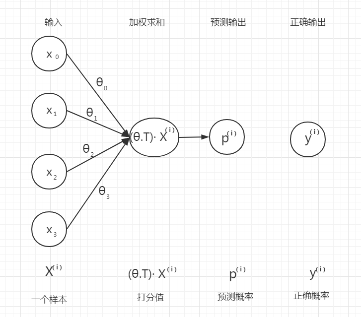

# 矩阵形式的逻辑回归模型

## 矩阵形式的逻辑回归模型的公式表和符号表

矩阵形式的逻辑回归模型计算公式如下，后文对这些公式给出了详细的证明过程。

### 公式表
|模型名称|模型概率输出函数|模型的分类决策函数|模型损失函数|模型损失函数的梯度|
|-|-|-|-|-|
线性回归模型|$\hat{P} = \sigma(\boldsymbol X\theta)$|$\hat{Y}=where(\hat{P}>=0.5, 1, 0)$|$J(\boldsymbol{\theta}) =-\dfrac{1}{m}[Y^T log(\hat{P})+(1-Y^T)log(1-\hat{P})]$|$\nabla_{w} Loss = \frac{1}{m}{X}^T(P-Y)$|

### 符号表
|符号|向量形式|维度|意义
|-|-|-|-|
|$x$|$[x_0,x_1,...,x_n]^T$|(n,1)|$x$ 表示一个样本实例， $x_i$ 表示向量的第 $i$ 维特征。|
|$X$|$[{(x^{(1)})}^T,{(x^{(2)})}^T,...{(x^{(m)})}^T]$| (m,n)|样本矩阵，一共 $m$ 个样例，每个样例有 $n$ 个特征值，$x^{(i)}$ 表示第 $i$ 个样例。|
|$\theta$|${[\theta_0,\theta_1,..,\theta_n]}^T$|(n,1)|权重向量|
|$\hat p_{j}$|标量|(1,1)|第 $j$ 个样例的预测概率值|
|$y_{j}$|标量|(1,1)|第 $j$ 个样例的标签概率值，0或者1|
|$\hat y_{j}$|标量|(1,1)|第 $j$ 个样例的预测的标签概率值，0或者1|
|$\hat P$|${[\hat p_{1},\hat p_{2},..,\hat p_{m}]}^T$|(m,1)|预测概率向量|
|$\hat{Y}$|${[y^{(1)},y^{(2)},...,y^{(m)}]}^T$|(m,1)|分类决策向量|
|$Y$|${[y^{(1)},y^{(2)},...,y^{(m)}]}^T$|(m,1)|标签向量|
|$Loss$|标量|(1,1)|损失函数|
|$\nabla_{\boldsymbol{\theta}} Loss$||(n,m)|损失函数梯度矩阵|

**注意：对于向量来说，上标和下标做同一个意思理解，比如 $\hat{p}_j$ 与 $\hat{p}^{(j)}$ 都是指向量 $\hat{p}$ 的第 $j$ 个分量理解。**

## 逻辑回归模型

一些回归算法也可以用于分类（反之亦然）。 Logistic 回归通常用于估计一个实例属于某个特定类别的概率。 如果估计的概率大于 50%，那么模型预测这个实例属于当前类（称为正类，标记为“1”），反之预测它不属于当前类（即它属于负类 ，标记为“0”）。 这样逻辑回归模型便成为了一个二元分类器。

## 逻辑回归模型的预测函数

逻辑回归模型的概率预测函数仅仅是将线性回归模型的输出函数的输出结果经过了sigmoid 逻辑函数的转换！

先回忆一下归线性回归模型的输出函数：

$\hat{y}=\theta_0+\theta_1x_1+\theta_2x_2+···+\theta_nx_n$

|符号|意义|
|-|-|-|-|
|$\hat{y}$|权重和|
|$n$|特征个数|
|$x_i$|样本向量 $x$ 的第 $i$ 个特征值|
|$\theta_i$|参数向量 $\theta$ 的 $i$ 个权重值|

线性回归模型输出函数的向量形式，

$\hat{y}=h_{\theta}(x)={\theta}^T·x$

|符号|名称|维度|
|-|-|-|-|
|$h_{\theta}(x)$|假设函数|
|$\theta$|参数向量|(n,1)|
|$x$|样例向量|(n,1)|

向量形式的逻辑回归模型的概率估计函数：

$$
\hat{p} = h_{\boldsymbol{\theta}}(\mathbf{x}) = \sigma(\boldsymbol{\theta}^T \mathbf{x})
$$

Logistic 函数，用 $\sigma(t)$ 表示，其是一个 sigmoid 函数（图像呈 S 型），它的输出是一个介于 0 和 1 之间的数字。sigmoid 逻辑函数定义如下，

$$\sigma(t)=\frac{1}{1+exp(-t)}$$

一旦 Logistic 回归模型估计得到了 $\mathbf{x}$ 属于正类的概率 $\hat{p}=h_\theta(\mathbf{x})$，那它很容易得到预测结果 $\hat{y}$。

逻辑回归预测模型的分类决策函数，

$$
\hat{y} =
\begin{cases}
  0 & \text{if } \hat{p} < 0.5, \\
  1 & \text{if } \hat{p} \geq 0.5.
\end{cases}
$$

注意当 t<0 时 $\sigma(t)<0.5$，当 $t\geq0$ 时 $\sigma(t)\geq0.5$，因此当$\theta^T  \mathbf{x}$ 是正数的话，逻辑回归模型输出 1，如果它是负数的话，则输出 0。

矩阵形式的逻辑回归模型的预测概率函数：

$$
\hat{P} = h_{\boldsymbol{\theta}}(\mathbf{X}) = \sigma(\boldsymbol X\theta)
$$

矩阵形式的逻辑回归模型的分类决策函数：

$$\hat{Y}=where(\hat{P}>=0.5, 1, 0)$$

$\hat{Y}=where(\hat{P}>=0.5, 1, 0)$ 表示如果预测概率向量 $\hat{P}$ 的某个元素值大于等于 0.5，那么该元素对应位置的 $\hat{Y}$ 元素为 1，否则为 0。

## 逻辑回归模型的对数损失函数

逻辑回归模型的损失函数是对数损失函数，

$$
J(\boldsymbol{\theta}) = -\dfrac{1}{m} \sum\limits_{i=1}^{m}{\left[ y^{(i)} log\left(\hat{p}^{(i)}\right) + (1 - y^{(i)}) log\left(1 - \hat{p}^{(i)}\right)\right]}
$$

矩阵形式的逻辑回归模型的损失函数，

$$J(\boldsymbol{\theta}) =-\dfrac{1}{m}[Y^T log(\hat{P})+(1-Y^T)log(1-\hat{P})]$$

也有下面这样等价的函数写法，

$$J(\boldsymbol{\theta}) =-mean(where(Y==1,log(\hat{P}),log(1-\hat{P})))$$

$(where(Y==1,log(\hat{P}),log(1-\hat{P})))$ 表示如果矩阵 $Y$ 中的元素值为 1，该元素的位置为 $(i,j)$ ，那么保留矩阵 $\hat{P}$ 中对应位置的元素，反之则用 $1$ 减去该位置元素的值替换掉原来该位置的值。$mean$ 表示求和取平均。

## 逻辑回归模型交叉熵损失函数的梯度向量

一般形式的逻辑回归模型的梯度向量为，下面首先来证明它。

$$
\dfrac{\partial}{\partial \theta_j} \text{J}(\boldsymbol{\theta}) = \dfrac{1}{m}\sum\limits_{i=1}^{m}\left(\mathbf{\sigma(\boldsymbol{\theta}}^T \mathbf{x}^{(i)}) - y^{(i)}\right)\, x_j^{(i)}
$$

已知：
逻辑回归模型的损失函数是对数损失函数为，

$$
J(\boldsymbol{\theta}) = -\dfrac{1}{m} \sum\limits_{i=1}^{m}{\left[ y^{(i)} log\left(\hat{p}^{(i)}\right) + (1 - y^{(i)}) log\left(1 - \hat{p}^{(i)}\right)\right]}
$$

向量形式的逻辑回归模型的概率估计函数为，

$$
\hat{p} = h_{\boldsymbol{\theta}}(\mathbf{x}) = \sigma(\boldsymbol{\theta}^T \mathbf{x})
$$

证明：

代价函数 $J$ 对 $\theta_j$ 求偏导，

$$
\begin{aligned}
\frac{\partial J}{\partial \theta_j} &= -\dfrac{1}{m}\sum\limits_{i=1}^{m} \left(
  \frac{y^{(i)}}{{\hat{p}}^{(i)}} -\frac{1-y^{(i)}}{1-{\hat{p}}^{(i)}} \right)
  \frac{\partial {\hat{p}}^{(i)}}{\partial \theta_j} \\
  &=  -\dfrac{1}{m}\sum\limits_{i=1}^{m}\left( \frac{y^{(i)} }{{\hat{p}}^{(i)}} -\frac{1-y^{(i)}}{1-{\hat{p}}^{(i)}} \right) {\hat{p}}^{(i)}(1-{\hat{p}}^{(i)})x_j\\
  &= \dfrac{1}{m}\sum\limits_{i=1}^{m} ({\hat{p}}^{(i)}-y^{(i)}){x_j}^{(i)}
\end{aligned}
$$

----

其中$\dfrac{\partial \hat{p}}{\partial \theta_j}$ 来自下面的证明，根据 $\hat{p}$ 定义

$$
\hat{p} = h_{\boldsymbol{\theta}}(\mathbf{x}) = \sigma(\boldsymbol{\theta}^T \mathbf{x})
$$

所以

$$
\dfrac{\partial \hat{p}}{\partial \theta_j} = {\sigma}'(\boldsymbol{\theta}^T \mathbf{x})x_j
$$

又根据 $\sigma(z) = 1/(1+e^{-z})$ 的定义，可知，

$$
\begin{aligned}
\sigma'(z) &= (\frac{1}{1+e^{-z}})'
\\
&= \frac{e^{-z}}{(1+e^{-z})^{2}}
\\
&= \frac{1+e^{-z}-1}{(1+e^{-z})^{2}}  
\\
&= \frac{1}{(1+e^{-z})}(1-\frac{1}{(1+e^{-z})})
\\
&= \sigma(z)(1-\sigma(z))
\\
\end{aligned}
$$

把 $\sigma'(z)$ 带入 $\dfrac{\partial \hat{p}}{\partial \theta_j}$ 可得

$$
\dfrac{\partial \hat{p}}{\partial \theta_j} = \hat{p}(1-\hat{p})x_j$$

-----

上面已经征得代价函数 $J$ 对 $\theta_j$ 求偏导的结果为，

$$
\frac{\partial J}{\partial \theta_j} = \dfrac{1}{m}\sum\limits_{i=1}^{m} ({\hat{p}}^{(i)}-y^{(i)}){x_j}^{(i)}
$$

因为$\hat{p} =\sigma(\boldsymbol{\theta}^T \mathbf{x})$，带入上面式子，可得一般形式的逻辑回归模型的梯度向量，

$$
\dfrac{\partial}{\partial \theta_j} \text{J}(\boldsymbol{\theta}) = \dfrac{1}{m}\sum\limits_{i=1}^{m}\left(\mathbf{\sigma(\boldsymbol{\theta}}^T \mathbf{x}^{(i)}) - y^{(i)}\right)\, x_j^{(i)}
$$

## 证明：矩阵形式的逻辑回归模型交叉熵损失函数的梯度向量

已知一般形式的逻辑回归模型的梯度向量，

$$
\frac{\partial J}{\partial \theta_j} = \dfrac{1}{m}\sum\limits_{i=1}^{m} ({\hat{p}}^{(i)}-y^{(i)}){x_j}^{(i)}
$$

先改写成向量形式逻辑回归模型的梯度向量， $J$ 对 $\theta$ 求偏导的结果为，

$$
\frac{\partial J}{\partial \theta} = \dfrac{1}{m}\sum\limits_{i=1}^{m}({\hat{p}}^{(i)}-y^{(i)}){x}^{(i)}
$$

再把上面式子写成矩阵形式，

$$
\begin{aligned}
\nabla_{\theta} Loss
&= \frac{1}{m} [{x}^{(1)}(\hat{p}^{(1)}-y^{(1)}),{x}^{(2)}(\hat{p}^{(2)}-y^{(2)}),...,{x}^{(m)}(\hat{p}^{(m)}-y^{(m)})]\\
&= \frac{1}{m}{X}^T(\hat{P}-Y) \\
\end{aligned}
$$

交叉熵损失函数的梯度向量计算公式为：

$$
\nabla_{\theta} Loss = \frac{1}{m}{X}^T(P-Y)
$$

若把 $A$ 作为概率输出矩阵，$A=P$；$Y$ 作为标签矩阵，那么，

交叉熵损失函数的梯度向量计算公式又可以表示为（这么做是为了与线性回归的形式统一）：

$$
\nabla_{\theta} Loss = \frac{1}{m}{X}^T(A-Y)
$$
